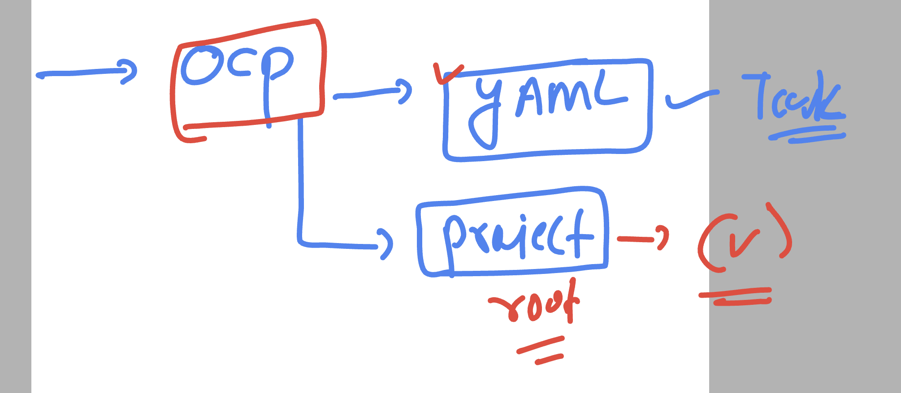

# docker-k8s-ocp-kyndryl

### revision 


### Ground rules for openshift 


## commands in openshift

### project listing 

```
[ashu@ip-172-31-91-107 ~]$ oc  projects 
You have access to the following projects and can switch between them with ' project <projectname>':

    ashwini-new
    ashwini-openshift
  * default
    kube-node-lease
    kube-public
    kube-system
    nagashree-project
    nagu-openshift
    nidhi-project

=======>
[ashu@ip-172-31-91-107 ~]$ oc get  ns
NAME                                               STATUS   AGE
ashwini-new                                        Active   21h
ashwini-openshift                                  Active   20h
default                                            Active   2d1h
kube-node-lease                                    Active   2d1h
kube-public                                        Active   2d1h
kube-system                                        Active   2d1h
nagashree-project                                  Active   21h
nagu-openshift                                     Active   20h

===========>>

```

### checking current project

```
[ashu@ip-172-31-91-107 ~]$ oc  project
Using project "default" on server "https://api.dev-cluster.ashutoshh.in:6443".
[ashu@ip-172-31-91-107 ~]$ 


```

## POd manifest file 

```
[ashu@ip-172-31-91-107 ~]$ ls
backup  openshift-demos
[ashu@ip-172-31-91-107 ~]$ cd  openshift-demos/
[ashu@ip-172-31-91-107 openshift-demos]$ ls
[ashu@ip-172-31-91-107 openshift-demos]$ oc  run  ashu-webapp --image=dockerashu/ashu-customer1:releasev1 --port 80 --dry-run=client -o yaml 
apiVersion: v1
kind: Pod
metadata:
  creationTimestamp: null
  labels:
    run: ashu-webapp
  name: ashu-webapp
spec:
  containers:
  - image: dockerashu/ashu-customer1:releasev1
    name: ashu-webapp
    ports:
    - containerPort: 80
    resources: {}
  dnsPolicy: ClusterFirst
  restartPolicy: Always
status: {}
[ashu@ip-172-31-91-107 openshift-demos]$ oc  run  ashu-webapp --image=dockerashu/ashu-customer1:releasev1 --port 80 --dry-run=client -o yaml >pod1.yaml 
[ashu@ip-172-31-91-107 openshift-demos]$ 
```

### updating manifest file to consume env 

```
apiVersion: v1
kind: Pod
metadata:
  creationTimestamp: null
  labels:
    run: ashu-webapp
  name: ashu-webapp
spec:
  containers:
  - image: dockerashu/ashu-customer1:releasev1
    name: ashu-webapp
    ports:
    - containerPort: 80
    resources: {}
    env: # calling env of docker image 
    - name: web # name of env variable 
      value: myapp3 # value of env var
  dnsPolicy: ClusterFirst
  restartPolicy: Always
status: {}

```

### creating pod 

```
[ashu@ip-172-31-91-107 openshift-demos]$ oc  apply -f pod1.yaml 
Warning: would violate PodSecurity "restricted:latest": allowPrivilegeEscalation != false (container "ashu-webapp" must set securityContext.allowPrivilegeEscalation=false), unrestricted capabilities (container "ashu-webapp" must set securityContext.capabilities.drop=["ALL"]), runAsNonRoot != true (pod or container "ashu-webapp" must set securityContext.runAsNonRoot=true), seccompProfile (pod or container "ashu-webapp" must set securityContext.seccompProfile.type to "RuntimeDefault" or "Localhost")
pod/ashu-webapp created
[ashu@ip-172-31-91-107 openshift-demos]$ 
[ashu@ip-172-31-91-107 openshift-demos]$ oc  get  pods
NAME             READY   STATUS              RESTARTS   AGE
ashu-pod         1/1     Running             0          63m
ashu-webapp      1/1     Running             0          13s
```

### Understanding it 


### ingress vs routes 


### creating service by exposing pods

```
[ashu@ip-172-31-91-107 openshift-demos]$ oc  get  po
NAME               READY   STATUS    RESTARTS   AGE
ashu-webapp        1/1     Running   0          12m
ashwini-webapp     1/1     Running   0          12m
nagashree-webapp   1/1     Running   0          12m
nidhi-webapp       1/1     Running   0          11m
rakshitha-webapp   1/1     Running   0          12m
yashna-webapp      1/1     Running   0          11m
[ashu@ip-172-31-91-107 openshift-demos]$ oc  expose pod ashu-webapp --type ClusterIP --port 80 --name ashu-ui --dry-run=client -o yaml  >svc.yaml 
[ashu@ip-172-31-91-107 openshift-demos]$ ls
pod1.yaml  svc.yaml
[ashu@ip-172-31-91-107 openshift-demos]$ oc apply -f svc.yaml 
service/ashu-ui created
[ashu@ip-172-31-91-107 openshift-demos]$ oc get  svc
NAME         TYPE           CLUSTER-IP     EXTERNAL-IP                            PORT(S)   AGE
ashu-ui      ClusterIP      172.30.23.70   <none>                                 80/TCP    3s
```

### creating routes by exposing service

```
[ashu@ip-172-31-91-107 openshift-demos]$ oc  expose service ashu-ui --name  ashu-access --dry-run=client -o yaml >route1.yaml 
[ashu@ip-172-31-91-107 openshift-demos]$ oc apply -f route1.yaml 
route.route.openshift.io/ashu-access created
[ashu@ip-172-31-91-107 openshift-demos]$ oc get routes
NAME               HOST/PORT                                                PATH   SERVICES       PORT   TERMINATION   WILDCARD
ashu-access        ashu-access-default.apps.dev-cluster.ashutoshh.in               ashu-ui        80                   None
nagashree-access   nagashree-access-default.apps.dev-cluster.ashutoshh.in          nagashree-ui   80                   None
rakshitha-access   rakshitha-access-default.apps.dev-cluster.ashutoshh.in          rak
```
### getting openshift URL access

```
[ashu@ip-172-31-91-107 openshift-demos]$ oc  projects  | grep -i console 
    openshift-console
    openshift-console-operator
    openshift-console-user-settings
[ashu@ip-172-31-91-107 openshift-demos]$ 
[ashu@ip-172-31-91-107 openshift-demos]$

[ashu@ip-172-31-91-107 openshift-demos]$ oc get routes  -n openshift-console 
NAME        HOST/PORT                                                   PATH   SERVICES    PORT    TERMINATION          WILDCARD
console     console-openshift-console.apps.dev-cluster.ashutoshh.in            console     https   reencrypt/Redirect   None
downloads   downloads-openshift-console.apps.dev-cluster.ashutoshh.in          downloads   http    edge/Redirect        None
[ashu@ip-172-31-91-107 openshift-demos]$ 

```

## creating new project / namespace

### 

```
ashu@ip-172-31-91-107 openshift-demos]$ oc whoami
system:admin
[ashu@ip-172-31-91-107 openshift-demos]$ oc  new-project  ashu-day10
Now using project "ashu-day10" on server "https://api.dev-cluster.ashutoshh.in:6443".

You can add applications to this project with the 'new-app' command. For example, try:

    oc new-app rails-postgresql-example

to build a new example application in Ruby. Or use kubectl to deploy a simple Kubernetes application:

    kubectl create deployment hello-node --image=registry.k8s.io/e2e-test-images/agnhost:2.43 -- /agnhost serve-hostname


=======>
[ashu@ip-172-31-91-107 openshift-demos]$ oc project
Using project "ashu-day10" on server "https://api.dev-cluster.ashutoshh.in:6443".
[ashu@ip-172-31-91-107 openshift-demos]$ 


```

### creating deployment in new project 

```
[ashu@ip-172-31-91-107 openshift-demos]$ ls
deploy.yaml  pod1.yaml  route1.yaml  svc.yaml
[ashu@ip-172-31-91-107 openshift-demos]$ oc create -f deploy.yaml 
deployment.apps/ashu-dep created
[ashu@ip-172-31-91-107 openshift-demos]$ oc get  deploy 
NAME       READY   UP-TO-DATE   AVAILABLE   AGE
ashu-dep   0/1     1            0           7s
[ashu@ip-172-31-91-107 openshift-demos]$ oc get  pods
NAME                       READY   STATUS             RESTARTS     AGE
ashu-dep-dc4c58857-tvbqp   0/1     CrashLoopBackOff   1 (7s ago)   12s
[ashu@ip-172-31-91-107 openshift-demos]$ 

```

### checking logs 

```
ashu@ip-172-31-91-107 openshift-demos]$ oc get  pods
NAME                       READY   STATUS             RESTARTS     AGE
ashu-dep-dc4c58857-tvbqp   0/1     CrashLoopBackOff   1 (7s ago)   12s
[ashu@ip-172-31-91-107 openshift-demos]$ oc  logs  ashu-dep-dc4c58857-tvbqp 
cp: cannot create regular file '/var/www/html/LICENSE.txt': Permission denied
cp: cannot create regular file '/var/www/html/README.txt': Permission denied
cp: cannot create directory '/var/www/html/assets': Permission denied
cp: cannot create regular file '/var/www/html/elements.html': Permission denied
cp: cannot create regular file '/var/www/html/generic.html': Permission denied
cp: cannot create regular file '/var/www/html/html5up-phantom.zip': Permission denied
cp: cannot create directory '/var/www/html/images': Permission denied
cp: cannot create regular file '/var/www/html/index.html': Permission denied
AH00558: httpd: Could not reliably determine the server's fully qualified domain name, using 10.128.2.32. Set the 'ServerName' directive globally to suppress this message
(13)Permission denied: AH00058: Error retrieving pid file run/httpd.pid
AH00059: Remove it before continuing if it is corrupted.
[ashu@ip-172-31-91-107 openshift-demos]$ 
```

### reason for above error


### more options there



### to configure OC project for adoption any pod as root uid

```
[ashu@ip-172-31-91-107 openshift-demos]$ oc project
Using project "ashu-day10" on server "https://api.dev-cluster.ashutoshh.in:6443".
[ashu@ip-172-31-91-107 openshift-demos]$ 
[ashu@ip-172-31-91-107 openshift-demos]$ 
[ashu@ip-172-31-91-107 openshift-demos]$ oc adm policy add-scc-to-user anyuid -z default
clusterrole.rbac.authorization.k8s.io/system:openshift:scc:anyuid added: "default"
[ashu@ip-172-31-91-107 openshift-demos]$ 

```

### retest it 

```
[ashu@ip-172-31-91-107 openshift-demos]$ ls
deploy.yaml  pod1.yaml  route1.yaml  svc.yaml
[ashu@ip-172-31-91-107 openshift-demos]$ oc replace -f deploy.yaml --force
deployment.apps "ashu-dep" deleted
deployment.apps/ashu-dep replaced

[ashu@ip-172-31-91-107 openshift-demos]$ oc get  deploy
NAME       READY   UP-TO-DATE   AVAILABLE   AGE
ashu-dep   1/1     1            1           4s
[ashu@ip-172-31-91-107 openshift-demos]$ oc get  pods
NAME                       READY   STATUS    RESTARTS   AGE
ashu-dep-dc4c58857-b57cb   1/1     Running   0          7s
[ashu@ip-172-31-91-107 openshift-demos]$ 
```


