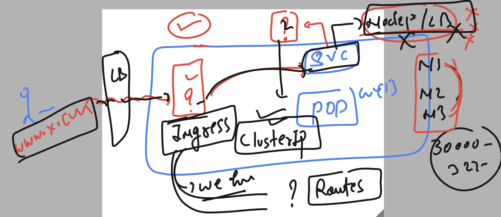
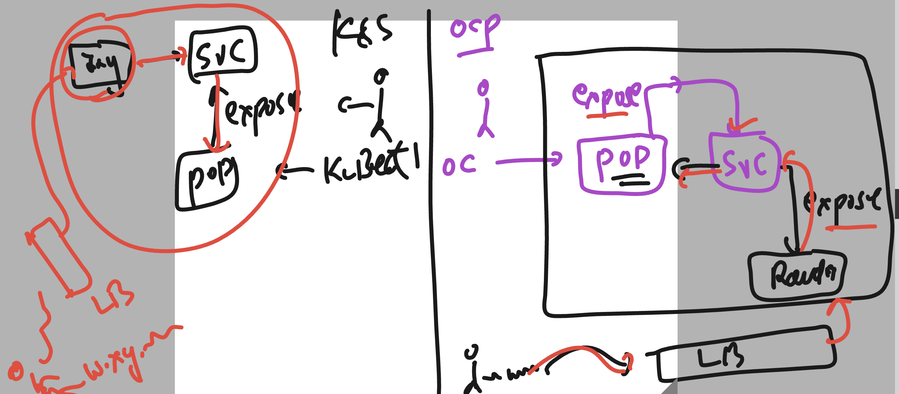

# docker-k8s-ocp-kyndryl

### revision 


### Ground rules for openshift 


## commands in openshift

### project listing 

```
[ashu@ip-172-31-91-107 ~]$ oc  projects 
You have access to the following projects and can switch between them with ' project <projectname>':

    ashwini-new
    ashwini-openshift
  * default
    kube-node-lease
    kube-public
    kube-system
    nagashree-project
    nagu-openshift
    nidhi-project

=======>
[ashu@ip-172-31-91-107 ~]$ oc get  ns
NAME                                               STATUS   AGE
ashwini-new                                        Active   21h
ashwini-openshift                                  Active   20h
default                                            Active   2d1h
kube-node-lease                                    Active   2d1h
kube-public                                        Active   2d1h
kube-system                                        Active   2d1h
nagashree-project                                  Active   21h
nagu-openshift                                     Active   20h

===========>>

```

### checking current project

```
[ashu@ip-172-31-91-107 ~]$ oc  project
Using project "default" on server "https://api.dev-cluster.ashutoshh.in:6443".
[ashu@ip-172-31-91-107 ~]$ 


```

## POd manifest file 

```
[ashu@ip-172-31-91-107 ~]$ ls
backup  openshift-demos
[ashu@ip-172-31-91-107 ~]$ cd  openshift-demos/
[ashu@ip-172-31-91-107 openshift-demos]$ ls
[ashu@ip-172-31-91-107 openshift-demos]$ oc  run  ashu-webapp --image=dockerashu/ashu-customer1:releasev1 --port 80 --dry-run=client -o yaml 
apiVersion: v1
kind: Pod
metadata:
  creationTimestamp: null
  labels:
    run: ashu-webapp
  name: ashu-webapp
spec:
  containers:
  - image: dockerashu/ashu-customer1:releasev1
    name: ashu-webapp
    ports:
    - containerPort: 80
    resources: {}
  dnsPolicy: ClusterFirst
  restartPolicy: Always
status: {}
[ashu@ip-172-31-91-107 openshift-demos]$ oc  run  ashu-webapp --image=dockerashu/ashu-customer1:releasev1 --port 80 --dry-run=client -o yaml >pod1.yaml 
[ashu@ip-172-31-91-107 openshift-demos]$ 
```

### updating manifest file to consume env 

```
apiVersion: v1
kind: Pod
metadata:
  creationTimestamp: null
  labels:
    run: ashu-webapp
  name: ashu-webapp
spec:
  containers:
  - image: dockerashu/ashu-customer1:releasev1
    name: ashu-webapp
    ports:
    - containerPort: 80
    resources: {}
    env: # calling env of docker image 
    - name: web # name of env variable 
      value: myapp3 # value of env var
  dnsPolicy: ClusterFirst
  restartPolicy: Always
status: {}

```

### creating pod 

```
[ashu@ip-172-31-91-107 openshift-demos]$ oc  apply -f pod1.yaml 
Warning: would violate PodSecurity "restricted:latest": allowPrivilegeEscalation != false (container "ashu-webapp" must set securityContext.allowPrivilegeEscalation=false), unrestricted capabilities (container "ashu-webapp" must set securityContext.capabilities.drop=["ALL"]), runAsNonRoot != true (pod or container "ashu-webapp" must set securityContext.runAsNonRoot=true), seccompProfile (pod or container "ashu-webapp" must set securityContext.seccompProfile.type to "RuntimeDefault" or "Localhost")
pod/ashu-webapp created
[ashu@ip-172-31-91-107 openshift-demos]$ 
[ashu@ip-172-31-91-107 openshift-demos]$ oc  get  pods
NAME             READY   STATUS              RESTARTS   AGE
ashu-pod         1/1     Running             0          63m
ashu-webapp      1/1     Running             0          13s
```

### Understanding it 



### ingress vs routes 




