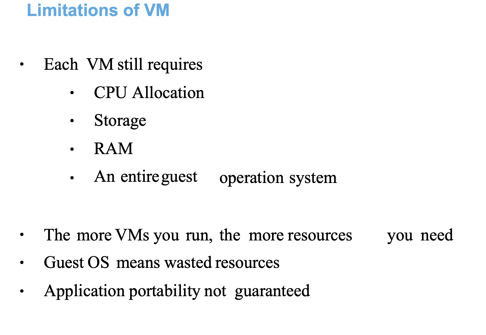

# docker-k8s-ocp-kyndryl

### revision 


### better than a physical server -= is testing or running app code in VM 


### VM limitations 



### Introduction to docker containers 


### verify docker connection 


```
[ashu@ip-172-31-91-107 ~]$ docker version 
Client:
 Version:           20.10.23
 API version:       1.41
 Go version:        go1.18.9
 Git commit:        7155243
 Built:             Tue Apr 11 22:56:36 2023
 OS/Arch:           linux/amd64
 Context:           default
 Experimental:      true

Server:
 Engine:
  Version:          20.10.23
  API version:      1.41 (minimum version 1.12)
  Go version:       go1.18.9
  Git commit:       6051f14
  Built:            Tue Apr 11 22:57:17 2023
  OS/Arch:          linux/amd64
  Experimental:     false
 containerd:
```

### Docker env and container creation 


## try python code first 

### creating forlder to keep our code there

```
[ashu@ip-172-31-91-107 ~]$ whoami
ashu
[ashu@ip-172-31-91-107 ~]$ ls
[ashu@ip-172-31-91-107 ~]$ 
[ashu@ip-172-31-91-107 ~]$ mkdir  python-code java-code  webapp database
[ashu@ip-172-31-91-107 ~]$ ls
database  java-code  python-code  webapp
[ashu@ip-172-31-91-107 ~]$

```

### containerizing python code

### in python-code folder

### hello.py 

```
import time

while True:
    print("Hello all , welcome to python..!!")
    time.sleep(3)
    print("Welcome to Docker ..")
    time.sleep(2)
    print("Welcome to Containers ..!!")
    print("______________________")
    time.sleep(3)
```

### Dockerfile

```
FROM python
# FROM is gonna call python image env from Docker hub 
LABEL name="ashutoshh"
LABEL email="ashutoshh@linux.com"
# optional keyword in Dockerfile 
RUN mkdir /ashucode
# it is for running any command duration env creation in the docker image
COPY  hello.py /ashucode/hello.py 
# copy code to python env location
CMD ["python","/ashucode/hello.py"]
# cmd is only to run the code whenever you create container from this env image
 
```

### time to create env --(image) -- where you code and lang platform will be there

### check directory 

```
[ashu@ip-172-31-91-107 ~]$ ls
database  java-code  python-code  webapp
[ashu@ip-172-31-91-107 ~]$ ls  python-code/
Dockerfile  hello.py
```

### build env 

```
[ashu@ip-172-31-91-107 ~]$ ls
database  java-code  python-code  webapp
[ashu@ip-172-31-91-107 ~]$ ls  python-code/
Dockerfile  hello.py
[ashu@ip-172-31-91-107 ~]$ ls
database  java-code  python-code  webapp
[ashu@ip-172-31-91-107 ~]$ 
[ashu@ip-172-31-91-107 ~]$ docker  build   -t ashupython:v1   python-code/ 
Sending build context to Docker daemon  3.072kB
Step 1/6 : FROM python
latest: Pulling from library/python
785ef8b9b236: Pull complete 
5a6dad8f55ae: Pull complete 
bd36c7bfe5f4: Pull complete 
4d207285f6d2: Pull complete 
9402da1694b8: Pull complete 
9bdbf45d01af: Pull complete 
dd8b7ef87a9d: Pull complete 
4de52e7027c5: Pull complete 
Digest: sha256:9a1b705aecedc76e8bf87dfca091d7093df3f2dd4765af6c250134ce4298a584
Status: Downloaded newer image for python:latest
 ---> 608c79ebc6d5
Step 2/6 : LABEL name="ashutoshh"
 ---> Running in 4bdba788c3ed
Removing intermediate container 4bdba788c3ed
 ---> 89ed55beae3e
Step 3/6 : LABEL email="ashutoshh@linux.com"
 ---> Running in 0b4800507a34
Removing intermediate container 0b4800507a34
 ---> 77fc698f63a4
Step 4/6 : RUN mkdir /ashucode
 ---> Running in d8b9f350e465
Removing intermediate container d8b9f350e465
 ---> b5ab6d20923d
Step 5/6 : COPY  hello.py /ashucode/hello.py
 ---> 329742b3f0eb
Step 6/6 : CMD ["python","/ashucode/hello.py"]
 ---> Running in 9e002e913b66
Removing intermediate container 9e002e913b66
 ---> 942f59fc5524
Successfully built 942f59fc5524
Successfully tagged ashupython:v1
```

### verify images which is python env and the code 

```
[ashu@ip-172-31-91-107 ~]$ docker  images
REPOSITORY     TAG       IMAGE ID       CREATED          SIZE
yashnapython   v1        2116bf3896ce   29 seconds ago   1.01GB
ashupython     v1        942f59fc5524   30 seconds ago   1.01GB
ashpython      v1        6714cda7f47d   30 seconds ago   1.01GB
python         latest    608c79ebc6d5   6 weeks ago      1.01GB
```

### creating container from images to run python code

```
[ashu@ip-172-31-91-107 ~]$ docker  run  --name  ashuc1  -it -d   ashupython:v1  
41cc2f0a72dda9540ad3439a25db4fe5f79fb6d9126e5c4b0ca7974c1416c9d0
[ashu@ip-172-31-91-107 ~]$ docker  ps
CONTAINER ID   IMAGE           COMMAND                  CREATED         STATUS         PORTS     NAMES
41cc2f0a72dd   ashupython:v1   "python /ashucode/he…"   3 seconds ago   Up 3 seconds             ashuc1
[ashu@ip-172-31-91-107 ~]$ 
```

### understanding container creation from docker image


### checking output of python code running inside container 

```
 [ashu@ip-172-31-91-107 ~]$ docker logs  ashuc1 
Hello all , welcome to python..!!
Welcome to Docker ..
Welcome to Containers ..!!
______________________
Hello all , welcome to python..!
```

### to check output live 

```
docker logs  -f ashuc1 
```

### checking resource consumption by container 

```
[ashu@ip-172-31-91-107 ~]$ docker  stats  ashuc1
CONTAINER ID   NAME      CPU %     MEM USAGE / LIMIT     MEM %     NET I/O       BLOCK I/O   PIDS
41cc2f0a72dd   ashuc1    0.01%     3.777MiB / 7.748GiB   0.05%     1.14kB / 0B   0B / 0B     1


```

### life of container 


### stopping running container manually 

```
ashu@ip-172-31-91-107 ~]$ docker  stop  ashuc1 
ashuc1
[ashu@ip-172-31-91-107 ~]$ docker  ps
CONTAINER ID   IMAGE                COMMAND                  CREATED          STATUS          PORTS     NAMES
bb996854c0e2   ashpython:v2         "python /ashcode/hel…"   16 minutes ago   Up 16 minutes             ashwi2
838a1261808e   nagashreepython:v1   "python nagashreecod…"   21 minutes ago   Up 21 minutes             nagashree1
951d8e29742a   nidhipython:v1       "python nidhicode/he…"   22 minutes ago   Up 22 minutes             nidhi1
d96bf045c7db   rakpython:v1         "python rakshithacod…"   22 minutes ago   Up 22 minutes             rakctl
ee117e45e1a0   yashnapython:v1      "python /yashnacode/…"   23 minutes ago   Up 23 minutes             yashna1
[ashu@ip-172-31-91-107 ~]$ 


```

### removing -- stopped container 

```
[ashu@ip-172-31-91-107 ~]$ docker  rm ashuc1 
ashuc1
[ashu@ip-17
```

### choosing any specific python version to build code 

Dockerfile 
```

FROM python:3.8
LABEL name="ashutoshh"
LABEL email="ashutoshh@linux.com"
RUN mkdir /ashucode
COPY  hello.py /ashucode/hello.py 
CMD ["python","/ashucode/hello.py"]

 
```

### building again 

```
ashu@ip-172-31-91-107 ~]$ ls
database  java-code  python-code  webapp
[ashu@ip-172-31-91-107 ~]$ cd python-code/
[ashu@ip-172-31-91-107 python-code]$ ls
Dockerfile  hello.py  python38.dockerfile
[ashu@ip-172-31-91-107 python-code]$ docker build -t ashupython:v38 -f  python38.dockerfile   . 
Sending build context to Docker daemon  4.096kB
Step 1/6 : FROM python:3.8
3.8: Pulling from library/python
785ef8b9b236: Already exists 
5a6dad8f55ae: Already exists 
```

### verify image

```
[ashu@ip-172-31-91-107 python-code]$ docker images
REPOSITORY        TAG       IMAGE ID       CREATED              SIZE
ashupython        v38       48d02515ece5   About a minute ago   997MB
ashpython         v2        982a77b3465a   55 minutes ago       1.01GB
ashwinipython     v1        982a77b3465a   55 minutes ago       1.01GB
```

### creating container 

```
[ashu@ip-172-31-91-107 python-code]$ docker run -itd --name ashucc11 ashupython:v38 
8c483dcfb279690e33ac59a9ef7f720af7775c4f25f7a42b40aecf11c5e63b9b

[ashu@ip-172-31-91-107 python-code]$ docker ps
CONTAINER ID   IMAGE            COMMAND                  CREATED         STATUS        PORTS     NAMES
8c483dcfb279   ashupython:v38   "python /ashucode/he…"   2 seconds ago   Up 1 second             ashucc11

[ashu@ip-172-31-91-107 python-code]$ docker logs -f ashucc11
Hello all , welcome to python..!!
Welcome to Docker ..
Welcome to Containers ..!!
______________________
Hello all , welcome to python..!!
Welcome to Docker ..
```

### python code --> image-- containers


## Java code 

### hello.java

```
class hello { 
    public static void main(String args[]) 
    { 
        // test expression 
        while (true) { 
            System.out.println("Hello World"); 
            try {
                Thread.sleep(2000);
            } catch (Exception ex) {
                // Ignored
            }
  
            // update expression 
        } 
    } 
} 
```

### Dockerfile

```
FROM openjdk
LABEL name="ashutoshh"
RUN mkdir  /mycode
COPY hello.java /mycode/hello.java
WORKDIR /mycode
# is to change directory during image build time
RUN javac hello.java 
CMD ["java","hello"]
# this will be automatically run hello class wheneve we create contianer


```

### building java image

```
[ashu@ip-172-31-91-107 python-code]$ cd ..
[ashu@ip-172-31-91-107 ~]$ ls

database  java-code  python-code  webapp

[ashu@ip-172-31-91-107 ~]$ cd  java-code/

[ashu@ip-172-31-91-107 java-code]$ ls
Dockerfile  hello.java

[ashu@ip-172-31-91-107 java-code]$ docker build -t ashujava:v1 .  
Sending build context to Docker daemon  3.072kB
Step 1/7 : FROM openjdk
latest: Pulling from library/openjdk
```

### verify image

```
[ashu@ip-172-31-91-107 java-code]$ docker images  | grep ashu
ashujava          v1        cb69966deff9   35 seconds ago   470MB
```

### creating and verify container 

```
[ashu@ip-172-31-91-107 java-code]$ docker images  | grep java
yashnajava        v1        dfe2feffb6f1   23 seconds ago       470MB
nidhijava         v1        247e8fc593a0   About a minute ago   470MB
raksithajava      v1        5f0c7408fa6e   3 minutes ago        470MB
nagashreejava     v1        e0344decb41a   4 minutes ago        470MB
ashwinijava       v1        e3c652ce89e5   7 minutes ago        470MB
ashujava          v1        cb69966deff9   8 minutes ago        470MB


[ashu@ip-172-31-91-107 java-code]$ 
[ashu@ip-172-31-91-107 java-code]$ docker run -itd --name ashujavac1   ashujava:v1  
591c1fbc35fa96619ec8cd68898ca6730613de4b77d18c0cb3bc409d51688ac4

[ashu@ip-172-31-91-107 java-code]$ docker  ps
CONTAINER ID   IMAGE                 COMMAND                  CREATED          STATUS          PORTS     NAMES
591c1fbc35fa   ashujava:v1           "java hello"             3 seconds ago    Up 2 seconds              ashujavac1

====>>
[ashu@ip-172-31-91-107 java-code]$ docker logs  ashujavac1
Hello World
Hello World
Hello World
Hello World

====> Resource COnsumption
docker stats 
ONTAINER ID   NAME          CPU %     MEM USAGE / LIMIT     MEM %     NET I/O       BLOCK I/O   PIDS
76b514d30a31   nidhic1       0.10%     9.238MiB / 7.748GiB   0.12%     570B / 0B     0B / 0B     19
591c1fbc35fa   ashujavac1    0.10%     9.234MiB / 7.748GiB   0.12%     710B / 0B     0B / 0B     19
50faebe462af   rakshitha11   0.00%     4.715MiB / 7.748GiB   0.06%     990B / 0B     0B / 0B     1
```
