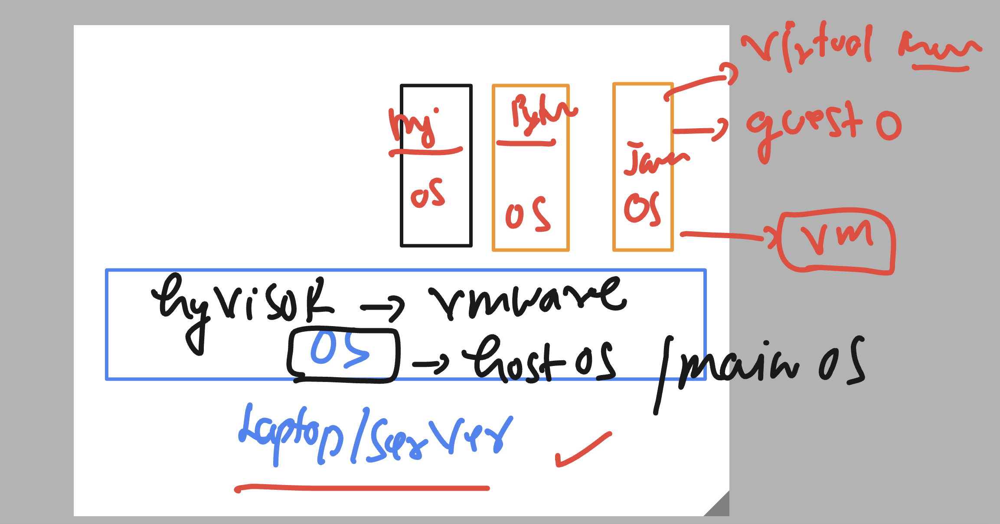
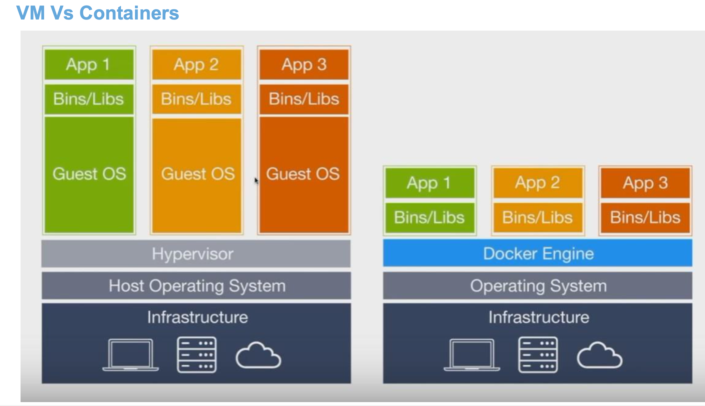

# docker-k8s-ocp-kyndryl

### revision 


### better than a physical server -= is testing or running app code in VM 



### VM limitations 


### Introduction to docker containers 



### verify docker connection 


```
[ashu@ip-172-31-91-107 ~]$ docker version 
Client:
 Version:           20.10.23
 API version:       1.41
 Go version:        go1.18.9
 Git commit:        7155243
 Built:             Tue Apr 11 22:56:36 2023
 OS/Arch:           linux/amd64
 Context:           default
 Experimental:      true

Server:
 Engine:
  Version:          20.10.23
  API version:      1.41 (minimum version 1.12)
  Go version:       go1.18.9
  Git commit:       6051f14
  Built:            Tue Apr 11 22:57:17 2023
  OS/Arch:          linux/amd64
  Experimental:     false
 containerd:
```

### Docker env and container creation 


## try python code first 

### creating forlder to keep our code there

```
[ashu@ip-172-31-91-107 ~]$ whoami
ashu
[ashu@ip-172-31-91-107 ~]$ ls
[ashu@ip-172-31-91-107 ~]$ 
[ashu@ip-172-31-91-107 ~]$ mkdir  python-code java-code  webapp database
[ashu@ip-172-31-91-107 ~]$ ls
database  java-code  python-code  webapp
[ashu@ip-172-31-91-107 ~]$

```

### containerizing python code

### in python-code folder

### hello.py 

```
import time

while True:
    print("Hello all , welcome to python..!!")
    time.sleep(3)
    print("Welcome to Docker ..")
    time.sleep(2)
    print("Welcome to Containers ..!!")
    print("______________________")
    time.sleep(3)
```

### Dockerfile

```
FROM python
# FROM is gonna call python image env from Docker hub 
LABEL name="ashutoshh"
LABEL email="ashutoshh@linux.com"
# optional keyword in Dockerfile 
RUN mkdir /ashucode
# it is for running any command duration env creation in the docker image
COPY  hello.py /ashucode/hello.py 
# copy code to python env location
CMD ["python","/ashucode/hello.py"]
# cmd is only to run the code whenever you create container from this env image
 
```

