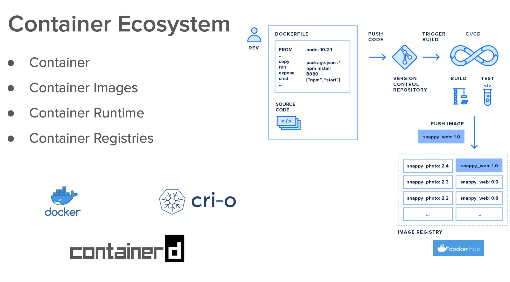
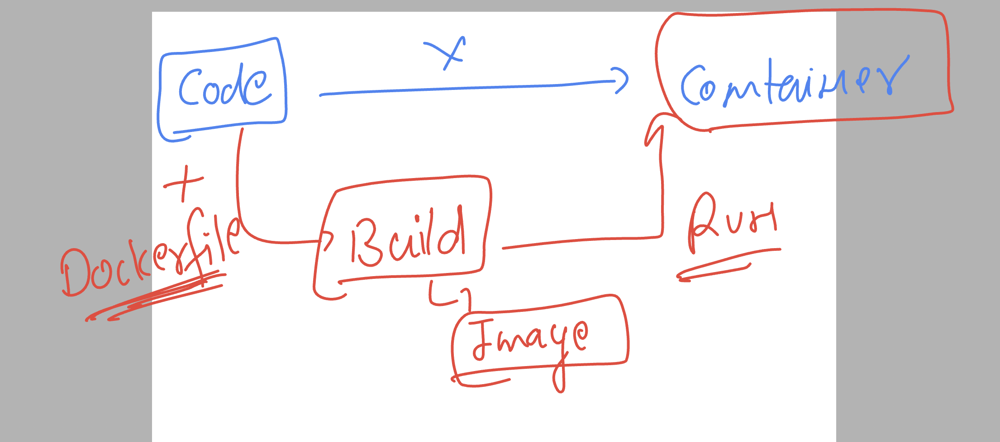
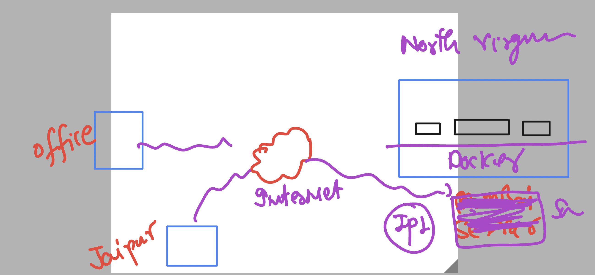
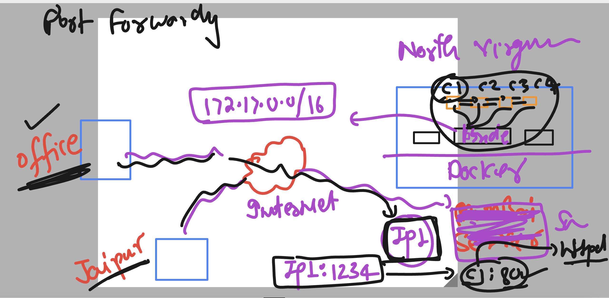
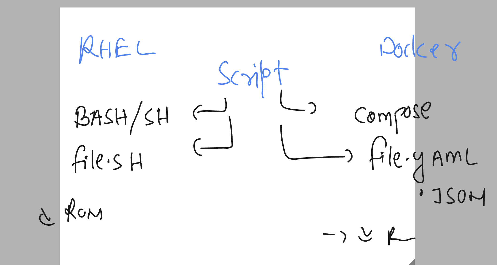

# docker-k8s-ocp-kyndryl

### Revision 



### container build and run process



### connecting to Lab 

```
[ashu@ip-172-31-91-107 ~]$ whoami
ashu
[ashu@ip-172-31-91-107 ~]$ docker images  | grep ashu
ashuhttpd         v1        01a983cf482a   20 hours ago    483MB
ashujava          v1        cb69966deff9   21 hours ago    470MB
ashupython        v38       48d02515ece5   22 hours ago    997MB
ashupython        v1        942f59fc5524   23 hours ago    1.01GB
[ashu@ip-172-31-91-107 ~]$ 

```

### containerizing sample frontend based webapp 

```
[ashu@ip-172-31-91-107 ~]$ ls
database  java-code  python-code  webapp
[ashu@ip-172-31-91-107 ~]$ git clone  https://github.com/codingstella/vCard-personal-portfolio.git
Cloning into 'vCard-personal-portfolio'...
remote: Enumerating objects: 69, done.
remote: Counting objects: 100% (16/16), done.
remote: Compressing objects: 100% (15/15), done.
remote: Total 69 (delta 3), reused 8 (delta 0), pack-reused 53
Receiving objects: 100% (69/69), 1.14 MiB | 26.60 MiB/s, done.
Resolving deltas: 100% (4/4), done.
[ashu@ip-172-31-91-107 ~]$ ls
database  java-code  python-code  vCard-personal-portfolio  webapp
[ashu@ip-172-31-91-107 ~]$ 


```

### adding Dockerifle and .dockerignore to the source code

### Dockerfile
```
FROM oraclelinux:8.4 
LABEL name="ashutoshh"
RUN yum install httpd -y 
COPY .  /var/www/html/
# . means all the files from current location to /var/www/html
CMD ["httpd","-DFOREGROUND"]
```

### .dockerignore

```
Dockerfile
.dockerignore
.git
index.txt
README.md
```

### building image of webbapp

```
ashu@ip-172-31-91-107 ~]$ ls
ashu-website  database  java-code  python-code  webapp
[ashu@ip-172-31-91-107 ~]$ cd  ashu-website/

[ashu@ip-172-31-91-107 ashu-website]$ ls
assets  Dockerfile  index.html  index.txt  README.md  website-demo-image
[ashu@ip-172-31-91-107 ashu-website]$

[ashu@ip-172-31-91-107 ashu-website]$ docker build -t  ashu-webapp:v1  .  
Sending build context to Docker daemon  1.305MB
Step 1/5 : FROM oraclelinux:8.4
 ---> 97e22ab49eea
Step 2/5 : LABEL name="ashutoshh"
 ---> Using cache
 ---> 598954f9b1d6
Step 3/5 : RUN yum install httpd -y
 ---> Using cache
 ---> 0435b09f5083
Step 4/5 : COPY .  /var/www/html/
 ---> 293fd1e6ab0a
Step 5/5 : CMD ["httpd","-DFOREGROUND"]
 ---> Running in 22363b994bac
Removing intermediate container 22363b994bac
 ---> 4d7a9b6ce0fe
Successfully built 4d7a9b6ce0fe
Successfully tagged ashu-webapp:v1
```

### time to create container 

```
[ashu@ip-172-31-91-107 ashu-website]$ docker run -itd --name ashuwebc1  ashu-webapp:v1 
38519d7fcabfbfc7813cd6fe57833113c9e29fc8649a46c5b13d6335381ae650

[ashu@ip-172-31-91-107 ashu-website]$ docker ps
CONTAINER ID   IMAGE            COMMAND                CREATED         STATUS         PORTS     NAMES
38519d7fcabf   ashu-webapp:v1   "httpd -DFOREGROUND"   7 seconds ago   Up 6 seconds             ashuwebc1
```
### to access web app running in contaienr we have to understand networking 

### case 1



#### Docker network list

```
ashu@ip-172-31-91-107 ashu-website]$ docker  network   ls
NETWORK ID     NAME      DRIVER    SCOPE
a77f7cab68b6   bridge    bridge    local
0b8774dae4d0   host      host      local
ec825402626e   none      null      local
[ashu@ip-172-31-91-107 ashu-website]$ 
```

### checking default ip address of container 

```
 140  docker  inspect  ashuwebc1 
  141  history 
[ashu@ip-172-31-91-107 ashu-website]$ docker  inspect  ashuwebc1   | grep -i ipaddr
            "SecondaryIPAddresses": null,
            "IPAddress": "172.17.0.2",
                    "IPAddress": "172.17.0.2",
```

### checking bridge stastus

```
[ashu@ip-172-31-91-107 ashu-website]$ docker network ls
NETWORK ID     NAME      DRIVER    SCOPE
a77f7cab68b6   bridge    bridge    local
0b8774dae4d0   host      host      local
ec825402626e   none      null      local
[ashu@ip-172-31-91-107 ashu-website]$ docker network  inspect  bridge  
[
    {
        "Name": "bridge",
        "Id": "a77f7cab68b6d6d48ce89ca4da4f4ec7e36e2de1c1dab8d4bf2952f4923281f3",
        "Created": "2023-08-02T07:23:48.086342207Z",
        "Scope": "local",
        "Driver": "bridge",
        "EnableIPv6": false,
        "IPAM": {
            "Driver": "default",
            "Options": null,
            "Config": [
                {
                    "Subnet": "172.17.0.0/16",
                    "Gateway": "172.17.0.1"
                }
            ]
        },
        "Internal": false,
        "Attachable": false,
        "Ingress": false,
        "ConfigFrom": {
            "Network": ""
        },
        "ConfigOnly": false,
        "Containers": {
            "38519d7fcabfbfc7813cd6fe57833113c9e29fc8649a46c5b13d6335381ae650": {
                "Name": "ashuwebc1",
                "EndpointID": "9fe041b2845bfd9084aab0a648f9badfc24688c9d279d46036769a4143cbbfb1",
                "MacAddress": "02:42:ac:11:00:02",
                "IPv4Address": "172.17.0.2/16",
                "IPv6Address": ""
            },
            "448a3f76fc9eea7f791fba2e51046246fc763a0e18f565b7a9db52fed7a2ccf9": {
                "Name": "yashnaweb1",
                "EndpointID": "0c1c5d0ae5375ba571afd98e26b1e995af46be8912558f11418dc72f0a5293f1",
                "MacAddress": "02:42:ac:11:00:04",
                "IPv4Address": "172.17.0.4/16",
                "IPv6Address": ""
            },
            "4cec429502e75d4c1b19177124fba8f32f9e2eaa9970925f575406bbae8dcbe1": {
                "Name": "yashna1",
                "EndpointID": "0bbc9f2de496873b41b9eb29f10f8cad6cf0bf18ac0615e88c14295f5b696e44",
                "MacAddress": "02:42:ac:11:00:03",
                "IPv4Address": "172.17.0.3/16",
                "IPv6Address": ""
            },
            "50b84d1c3e288a03a6f206c0b85ca375b12ce3660d7ded510ccf98b4da530349": {
                "Name": "nidhiwebc1",
                "EndpointID": "3a459ccd1d7b834330755e80063d4183b5cfcb361182468062ac446115fcebf6",
                "MacAddress": "02:42:ac:11:00:06",
                "IPv4Address": "172.17.0.6/16",
                "IPv6Address": ""
            },
            "619189c50207107c614d7f3f8782e2daee8224faee0471ea9a47530596d8264d": {
                "Name": "ashwiniwebc1",
                "EndpointID": "afda258eb45c0bb7ac07edfc1e7db10b4b0e950253df30826a2d4acd080d7248",
                "MacAddress": "02:42:ac:11:00:08",
                "IPv4Address": "172.17.0.8/16",
                "IPv6Address": ""
            },
            "9a349d9f71c0f3910be85012dfc4c50ff7b7403a47202af8c90f77932d692735": {
                "Name": "rakshithawebc1",
                "EndpointID": "9c013ca30757addfc88e26ddde7bdddbfc4f2c35483d3154c22eef82a76cd533",
                "MacAddress": "02:42:ac:11:00:07",
                "IPv4Address": "172.17.0.7/16",
                "IPv6Address": ""
            },
            "cf666365716e39d9b81a79c4cefd388d6c85388ff82c99fe158254e2f13bff40": {
                "Name": "nagashreewebc1",
                "EndpointID": "f2d6ac586bb03a792e5efe1c3067ea040eec510c11b07e86fb6c5c94eecb7d78",
                "MacAddress": "02:42:ac:11:00:05",
                "IPv4Address": "172.17.0.5/16",
                "IPv6Address": ""
            }
```

### to accesss container app from outside we are implementing port forwarding in container 



### creating container with port forwarding 

```
[ashu@ip-172-31-91-107 ashu-website]$ docker run -itd --name ashuwebc2  -p  1234:80  ashu-webapp:v1  
1eaca7be1272ddb2a4a1b010a433da9b3e6ae32dd6c871768028be289f94b39c
[ashu@ip-172-31-91-107 ashu-website]$ docker  ps
CONTAINER ID   IMAGE            COMMAND                CREATED         STATUS         PORTS                                   NAMES
1eaca7be1272   ashu-webapp:v1   "httpd -DFOREGROUND"   4 seconds ago   Up 2 seconds   0.0.0.0:1234->80/tcp, :::1234->80/tcp   ashuwebc2
[ashu@ip-172-31-91-107 ashu-website]$ 
```

### Solution of question 

```
[ashu@ip-172-31-91-107 ashu-website]$ docker  run -itd --name ashucimg   oraclelinux:8.4  
b0d8023b009482a57ff33178408af50b148cb351f7e1f04e02f890e3eccc8241

[ashu@ip-172-31-91-107 ashu-website]$ docker  ps
CONTAINER ID   IMAGE                 COMMAND                CREATED         STATUS         PORTS     NAMES
b0d8023b0094   oraclelinux:8.4       "/bin/bash"            6 seconds ago   Up 5 seconds             ashucimg
bf2b495fa47a   yashna-webapp:v1      "httpd -DFOREGROUND"   7 minutes ago   Up 7 minutes             yashnawebc3
c08a9aac2484   nagashree-webapp:v1   "httpd -DFOREGROUND"   8 minutes ago   Up 7 minutes             nagshreewebc3
c6068b2947c9   nidhi-webapp:v1       "httpd -DFOREGROUND"   8 minutes ago   Up 7 minutes             nidhiwebc3
abde11c0d903   ashwini-webapp:v1     "httpd -DFOREGROUND"   8 minutes ago   Up 8 minutes             ashwiniwebc3
705e3d9017ff   rakshitha-web:v1      "httpd -DFOREGROUND"   9 minutes ago   Up 9 minutes             rakshithawebc3
[ashu@ip-172-31-91-107 ashu-website]$

[ashu@ip-172-31-91-107 ashu-website]$ docker  exec  -it  ashucimg  bash 
[root@b0d8023b0094 /]# 
[root@b0d8023b0094 /]# yum install httpd vim  -y 
Oracle Linux 8 BaseOS Latest (x86_64)                                                                                     95 MB/s |  60 MB     00:00    
Oracle Linux 8 Application Stream (x86_64)


```

### exit from container and creating docker image 

```
[ashu@ip-172-31-91-107 ashu-website]$ docker  commit  ashucimg    ashucimg:v007 
sha256:4f0f1d72d9f229a2e25f1c188cac203f7b0a734c683470c45a59538dfb8d9afa
[ashu@ip-172-31-91-107 ashu-website]$ docker images  | grep ashu
ashucimg           v007      4f0f1d72d9f2   6 seconds ago    543MB
ashu-webapp        v1        4d7a9b6ce0fe   58 minutes ago   484MB
```

### Introducing docker-compose for scripting of the docker steps 



### checking docker-compose status

```
[ashu@ip-172-31-91-107 ashu-website]$ docker-compose version 
Docker Compose version v2.20.2
```

## docker Compose examples

### Example 1 -- SIngle container app 

```
version: '3.8'
services:
  ashu-app1: # name of my web app
    image: ashu-webapp:v1
    container_name: ashuwebc1
    ports:
      - 1234:80

```

### running compose file -- using up 

```
[ashu@ip-172-31-91-107 ~]$ cd  ashu-compose/
[ashu@ip-172-31-91-107 ashu-compose]$ ls
docker-compose.yaml
[ashu@ip-172-31-91-107 ashu-compose]$ docker-compose up -d 
[+] Running 2/2
 ✔ Network ashu-compose_default  Created                                                                                    0.0s 
 ✔ Container ashuwebc1           Started
                                                                              0.6s 
[ashu@ip-172-31-91-107 ashu-compose]$ docker-compose ps
NAME                IMAGE               COMMAND                SERVICE             CREATED             STATUS              PORTS
ashuwebc1           ashu-webapp:v1      "httpd -DFOREGROUND"   ashu-app1           10 seconds ago      Up 9 seconds        0.0.0.0:1234->80/tcp, :::1234->80/tcp

[ashu@ip-172-31-91-107 ashu-compose]$ docker-compose images
CONTAINER           REPOSITORY          TAG                 IMAGE ID            SIZE
ashuwebc1           ashu-webapp         v1                  4d7a9b6ce0fe        484MB
[ashu@ip-172-31-91-107 ashu-compose]$

```

### more compose operations

```
ashu@ip-172-31-91-107 ashu-compose]$ docker-compose ps
NAME                IMAGE               COMMAND                SERVICE             CREATED             STATUS              PORTS
ashuwebc1           ashu-webapp:v1      "httpd -DFOREGROUND"   ashu-app1           6 minutes ago       Up 6 minutes        0.0.0.0:1234->80/tcp, :::1234->80/tcp

[ashu@ip-172-31-91-107 ashu-compose]$ docker-compose stop 
[+] Stopping 1/1
 ✔ Container ashuwebc1  Stopped                                                                                                                     0.2s

[ashu@ip-172-31-91-107 ashu-compose]$ docker-compose ps
NAME                IMAGE               COMMAND             SERVICE             CREATED             STATUS              PORTS


[ashu@ip-172-31-91-107 ashu-compose]$ docker-compose ps -a
NAME                IMAGE               COMMAND                SERVICE             CREATED             STATUS                     PORTS
ashuwebc1           ashu-webapp:v1      "httpd -DFOREGROUND"   ashu-app1           7 minutes ago       Exited (0) 9 seconds ago


[ashu@ip-172-31-91-107 ashu-compose]$ docker-compose start
[+] Running 1/1
 ✔ Container ashuwebc1  Started                                                                                                                     0.6s


[ashu@ip-172-31-91-107 ashu-compose]$ docker-compose ps 
NAME                IMAGE               COMMAND                SERVICE             CREATED             STATUS              PORTS
ashuwebc1           ashu-webapp:v1      "httpd -DFOREGROUND"   ashu-app1           7 minutes ago       Up 4 seconds        0.0.0.0:1234->80/tcp, :::1234->80/tcp
```

### deleting all things created by compose 

```
ashu@ip-172-31-91-107 ashu-compose]$ docker-compose  down 
[+] Running 2/2
 ✔ Container ashuwebc1           Removed                                                                                                            0.2s 
 ✔ Network ashu-compose_default  Removed               
```

### Example 2 

```
version:  '3.8'
services:
  ashu-app1:
    image: ashuhttpd:v1 
    container_name: ashuc1
    ports:
    - 1234:80 
  ashu-app2:
    image: ashupython:v38 
    container_name: ashuc2 
    tty: true # like docker run -it 
```

### lets run it

```
[ashu@ip-172-31-91-107 ashu-compose]$ ls
docker-compose.yaml  example2.yaml

[ashu@ip-172-31-91-107 ashu-compose]$ docker-compose -f  example2.yaml  up -d 
[+] Running 3/3
 ✔ Network ashu-compose_default  Created                                                                                    0.0s 
 ✔ Container ashuc1              Started                                                                                    0.9s 
 ✔ Container ashuc2              Started
                                                                               0.8s 
[ashu@ip-172-31-91-107 ashu-compose]$ docker-compose -f  example2.yaml  ps
NAME                IMAGE               COMMAND                  SERVICE             CREATED             STATUS              PORTS
ashuc1              ashuhttpd:v1        "httpd -DFOREGROUND"     ashu-app1           13 seconds ago      Up 11 seconds       0.0.0.0:1234->80/tcp, :::1234->80/tcp

ashuc2              ashupython:v38      "python /ashucode/he…"   ashu-app2           13 seconds ago      Up 11 seconds       
[ashu@ip-172-31-91-107 ashu-compose]$ 

```
### checking logs 

```
[ashu@ip-172-31-91-107 ashu-compose]$ docker-compose -f  example2.yaml  logs  ashu-app2 
ashuc2  | Hello all , welcome to python..!!
ashuc2  | Welcome to Docker ..
ashuc2  | Welcome to Containers ..!!
ashuc2  | ______________________
ashuc2  | Hello all , welcome to python..!!
ashuc2  | Welcome to Docker ..
ashuc2  | Welcome to Containers ..!!
```


