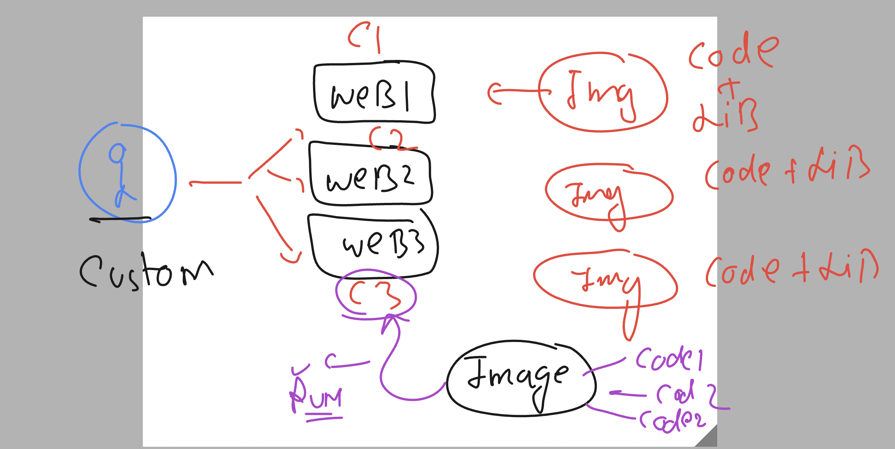
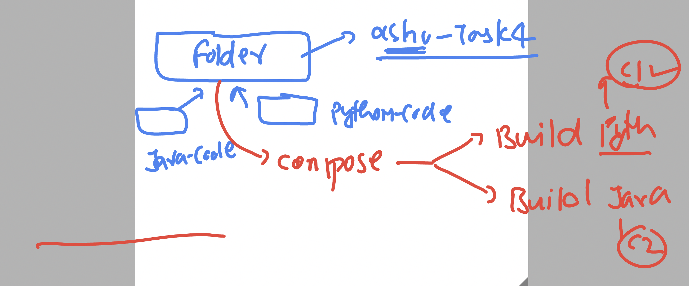

# docker-k8s-ocp-kyndryl

### Revision 


### custom story with docker 



### taking 3 sample applications from github 

```
 222  mkdir  ashu-customer
  224  cd  ashu-customer/
  226  git clone https://github.com/schoolofdevops/html-sample-app
  227  git clone https://github.com/microsoft/project-html-website
  228  git clone https://github.com/Yash-srivastav16/Tour-Project
```

### adding Dockerfile into it 

```
FROM oraclelinux:8.4
LABEL email="ashutoshh@linux.com"
ENV web=hello
# to create ENV variable and some value 
RUN yum install httpd -y 
RUN mkdir /code  /code/webapp1 /code/webapp2 /code/webapp3 
COPY html-sample-app /code/webapp1/
COPY project-html-website /code/webapp2/
ADD Tour-Project /code/webapp3/
# COPY and ADD both are almost same 
# add can take input from URL as well
COPY deploy.sh /code/
WORKDIR /code
# changing directory 
RUN chmod +x deploy.sh 
CMD ["./deploy.sh"]
```

### shell script 

```
#!/bin/bash

if  [ "$web" == "myapp1" ]
then
    cp -rf /code/webapp1/*  /var/www/html/
    httpd -DFOREGROUND 
elif [ "$web" == "myapp2" ]
then
    cp -rf /code/webapp2/* /var/www/html/
    httpd -DFOREGROUND 
elif [ "$web" == "myapp3" ]
then
    cp -rf /code/webapp3/* /var/www/html/
    httpd -DFOREGROUND
else 
    echo "Please check your variable or Value" >/var/www/html/index.html
    httpd -DFOREGROUND
fi 
```

## Docker-compose 

```
version: '3.8'
services:
  ashu-customer-webapp: # name of service / app 
    image: ashu-customer:imgv1 
    build:
      context: . # location of dockerfile from compose file 
      dockerfile: Dockerfile 
    container_name: ashuc11 
    ports: # docker server will accept traffic on 1234 to forward it cont at 80 
      - 1234:80 
```

### building all

```
[ashu@ip-172-31-91-107 ashu-customer]$ ls
deploy.sh  docker-compose.yaml  Dockerfile  html-sample-app  project-html-website  Tour-Project
[ashu@ip-172-31-91-107 ashu-customer]$ docker-compose up -d 
[+] Running 1/1
 ! ashu-customer-webapp Warning                                                                                             0.1s 
[+] Building 6.7s (5/13)                                                                                                         
 => [ashu-customer-webapp internal] load build definition from Dockerfile                                                   0.1s
 => => transferring dockerfile: 520B                                                                                        0.0s
 => [ashu-customer-webapp internal] load .dockerignore                                                                      0.0s
 => => transferring context: 2B                                                                                             0.0s
 => [ashu-customer-webapp internal] load metadata for docker.io/library/oraclelinux:8.4                                     0.0s
 => [ashu-customer-webapp 1/9] FROM docker.io/library/oraclelinux:8.4                                                       0.0s
 => [ashu-customer-webapp internal] load build context                                                                      0.3s
 => => transferring context: 15.37MB                                                                                        0.2s
 => [ashu-customer-webapp 2/9] RUN yum install httpd -y                                                                     6.6s
 => => # Oracle Linux 8 BaseOS Latest (x86_64)            95 MB/s |  61 MB     00:00                                            

```

### checking status

```
[ashu@ip-172-31-91-107 ashu-customer]$ docker-compose ps
NAME                IMAGE                 COMMAND             SERVICE                CREATED             STATUS              PORTS
ashuc11             ashu-customer:imgv1   "./deploy.sh"       ashu-customer-webapp   52 seconds ago      Up 51 seconds       0.0.0.0:1234->80/tcp, :::1234->80/tcp
```

### compose with 2 contaienr 

```
version: '3.8'
services:
  ashu-customer-webapp: # name of service / app 
    image: ashu-customer:imgv1 
    build:
      context: . # location of dockerfile from compose file 
      dockerfile: Dockerfile 
    container_name: ashuc11 
    ports: # docker server will accept traffic on 1234 to forward it cont at 80 
      - 1234:80 
  ashu-web2: 
    image: ashu-customer:imgv1
    container_name: ashuc22
    ports:
      - 4433:80 
    environment:
      web: "myapp2" 
```

### 

```
ashu@ip-172-31-91-107 ashu-customer]$ docker-compose up -d
[+] Running 2/2
 ✔ Container ashuc22  Started                                                                                               0.6s 
[ashu@ip-172-31-91-107 ashu-customer]$ docker-compose up -d
[+] Running 2/2
 ✔ Container ashuc11  Running                                                                                               0.0s 
 ✔ Container ashuc22  Started                                                                                              10.8s 
[ashu@ip-172-31-91-107 ashu-customer]$ docker-compose ps
NAME                IMAGE                 COMMAND             SERVICE                CREATED             STATUS              PORTS
ashuc11             ashu-customer:imgv1   "./deploy.sh"       ashu-customer-webapp   14 minutes ago      Up 14 minutes       0.0.0.0:1234->80/tcp, :::1234->80/tcp
ashuc22             ashu-customer:imgv1   "./deploy.sh"       ashu-web2              13 seconds ago      Up 2 seconds        0.0.0.0:4433->80/tcp, :::4433->80/tcp
[ashu@ip-172-31-91-107 ashu-customer]$ 
```

### compsoe adding one more container 

```
version: '3.8'
services:
  ashu-customer-webapp: # name of service / app 
    image: ashu-customer:imgv1 
    build:
      context: . # location of dockerfile from compose file 
      dockerfile: Dockerfile 
    container_name: ashuc11 
    ports: # docker server will accept traffic on 1234 to forward it cont at 80 
      - 1234:80 
  ashu-web2: 
    image: ashu-customer:imgv1
    container_name: ashuc22
    ports:
      - 4433:80 
    environment: # passing value to web ENV variable 
      web: "myapp2" 
  ashu-app1: 
    image: ashu-customer:imgv1
    container_name: ashuc33
    ports:
      - 3311:80
    environment:
      web: "myapp1"
```

### 

```
[ashu@ip-172-31-91-107 ashu-customer]$ docker-compose up -d
[+] Running 3/3
 ✔ Container ashuc22  Running                                                                                                                       0.0s 
 ✔ Container ashuc33  Started                                                                                                                       0.6s 
 ✔ Container ashuc11  Running                                                                                                                       0.0s 
[ashu@ip-172-31-91-107 ashu-customer]$ docker-compose ps
NAME                IMAGE                 COMMAND             SERVICE                CREATED             STATUS              PORTS
ashuc11             ashu-customer:imgv1   "./deploy.sh"       ashu-customer-webapp   14 minutes ago      Up 14 minutes       0.0.0.0:1234->80/tcp, :::1234->80/tcp
ashuc22             ashu-customer:imgv1   "./deploy.sh"       ashu-web2              14 minutes ago      Up 14 minutes       0.0.0.0:4433->80/tcp, :::4433->80/tcp
ashuc33             ashu-customer:imgv1   "./deploy.sh"       ashu-app1              11 seconds ago      Up 9 seconds        0.0.0.0:3311->80/tcp, :::3311->80/tcp
[ashu@ip-172-31-91-107 ashu-customer]$ 
```

### task 4




