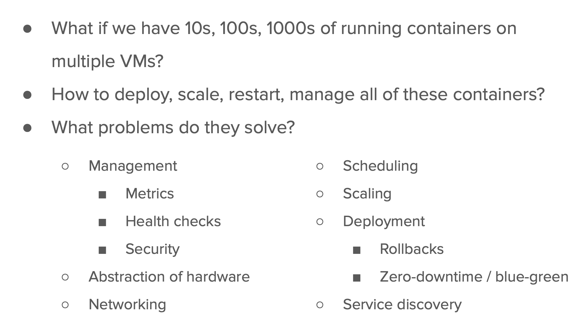

# docker-k8s-ocp-kyndryl

## Final docker-compsoe project

### env file for database things

### db.env 
```
MYSQL_ROOT_PASSWORD="Openshift@1122"
MYSQL_DATABASE="ashudb"
MYSQL_USER="ashu"
MYSQL_PASSWORD="Ashu@12345"
```

### Docker-compose file

```
version: '3.8'
volumes: # creating volumes 
  ashu-db-vol:  # name of volume 
services: # to create container in form of services
  ashu-db-app: 
    image: mysql # image will be pulled from Docker hub 
    container_name: ashudbc1 
    env_file:
      - db.env 
    volumes:  # attaching / mounting volume inside db container 
      - ashu-db-vol:/var/lib/mysql/ 

```

### testing only DB part 

```
[ashu@ip-172-31-91-107 final-project-ashu]$ ls
db.env  docker-compose.yaml
[ashu@ip-172-31-91-107 final-project-ashu]$ docker-compose up -d 
[+] Running 11/11
 ✔ ashu-db-app 10 layers [⣿⣿⣿⣿⣿⣿⣿⣿⣿⣿]      0B/0B      Pulled                                                               10.1s 
   ✔ 49bb46380f8c Pull complete                                                                                             2.7s 
   ✔ aab3066bbf8f Pull complete                                                                                             2.8s 
   ✔ d6eef8c26cf9 Pull complete                                                                                             2.8s 
   ✔ 0e908b1dcba2 Pull complete                                                                                             3.1s 
   ✔ 480c3912a2fd Pull complete                                                                                             3.2s 
   ✔ ef90fc42d4db Pull complete                                                                                             3.2s 
   ✔ a2f7c585c753 Pull complete                                                                                             5.0s 
   ✔ e2ef842ff3d6 Pull complete                                                                                             5.1s 
   ✔ c6c990e874d7 Pull complete                                                                                             9.7s 
   ✔ a554d403eafe Pull complete                                                                                             9.8s 
[+] Running 3/3
 ✔ Network final-project-ashu_default       Created                                                                         0.1s 
 ✔ Volume "final-project-ashu_ashu-db-vol"  Created                                                                         0.0s 
 ✔ Container ashudbc1                       Started                                                                         4.7s 
[ashu@ip-172-31-91-107 final-project-ashu]$ 
```

### verify 

```
[ashu@ip-172-31-91-107 final-project-ashu]$ docker-compose ps
NAME                IMAGE               COMMAND                  SERVICE             CREATED             STATUS              PORTS
ashudbc1            mysql               "docker-entrypoint.s…"   ashu-db-app         27 seconds ago      Up 22 seconds       3306/tcp, 33060/tcp
```

### adding webapp in the compsoe file

```
version: '3.8'
volumes: # creating volumes 
  ashu-db-vol:  # name of volume 
services: # to create container in form of services
  ashu-db-app: 
    image: mysql # image will be pulled from Docker hub 
    container_name: ashudbc1 
    env_file:
      - db.env 
    volumes:  # attaching / mounting volume inside db container 
      - ashu-db-vol:/var/lib/mysql/ 
  ashu-web-app: # create app which is going to connect db 
    image: adminer 
    container_name:  ashuwebc1
    ports:
      - 1234:8080 
    depends_on: # my webapp will wait for db app to run first 
      - ashu-db-app 

```

### rerun docker compose 

```
[ashu@ip-172-31-91-107 final-project-ashu]$ ls
db.env  docker-compose.yaml
[ashu@ip-172-31-91-107 final-project-ashu]$ docker-compose up -d
[+] Running 8/8
 ✔ ashu-web-app 7 layers [⣿⣿⣿⣿⣿⣿⣿]      0B/0B      Pulled                                                                   5.5s 
   ✔ 9a9e034800a1 Pull complete                                                                                             3.1s 
   ✔ a93e89405fb5 Pull complete                                                                                             4.8s 
   ✔ 0e87fd288de6 Pull complete                                                                                             4.9s 
   ✔ a71b1e29bbc6 Pull complete                                                                                             4.9s 
   ✔ cba31560d427 Pull complete                                                                                             5.0s 
   ✔ c9a622b0a973 Pull complete                                                                                             5.1s 
   ✔ e93b37eef6ad Pull complete                                                                                             5.2s 
[+] Running 2/2
 ✔ Container ashudbc1   Running                                                                                             0.0s 
 ✔ Container ashuwebc1  Started                                                                                             2.1s 
[ashu@ip-172-31-91-107 final-project-ashu]$ docker-compose ps
NAME                IMAGE               COMMAND                  SERVICE             CREATED              STATUS              PORTS
ashudbc1            mysql               "docker-entrypoint.s…"   ashu-db-app         9 minutes ago        Up 9 minutes        3306/tcp, 33060/tcp
ashuwebc1           adminer             "entrypoint.sh php -…"   ashu-web-app        About a minute ago   Up About a minute   0.0.0.0:1234->8080/tcp, :::1234->8080/tcp
[ashu@ip-172-31-91-107 final-project-ashu]$ 
```

### understanding journey 


## problem in container docker if -- the big companies are gonna use it like Netflix & hotstar



### A solution by GOogle -- product called Kubernetes (k8s)


## Understanding k8s -- How it gonna solve problems 

## k8s -architecture 

### basic layers -- 3 layer (k8s clients -- k8s master -- k8s workers )


### K8s master components 

## components of control plane / master server


### api-server role in k8s control plane 


### k8s client side software options 


### installed kubectl on linux machine -- 

```
[ashu@ip-172-31-91-107 ~]$ kubectl 
kubectl controls the Kubernetes cluster manager.

 Find more information at: https://kubernetes.io/docs/reference/kubectl/

Basic Commands (Beginner):
  create          Create a resource from a file or from stdin
  expose          Take a replication controller, service, deployment or pod and expose it as a new Kubernetes service
  run             Run a particular image on the cluster
  set             Set specific features on objects

```

### after having cred file from control plane lets send first request to Apiserver

```
[ashu@ip-172-31-91-107 ~]$ kubectl   get  nodes   --kubeconfig  admin.conf  
NAME     STATUS   ROLES           AGE    VERSION
master   Ready    control-plane   157m   v1.27.4
node1    Ready    <none>          153m   v1.27.4
node2    Ready    <none>          153m   v1.27.4
[ashu@ip-172-31-91-107 ~]$ 
```

### checking cluster info  

```
[ashu@ip-172-31-91-107 ~]$ kubectl  cluster-info  --kubeconfig  admin.conf  
Kubernetes control plane is running at https://172.31.86.69:6443
CoreDNS is running at https://172.31.86.69:6443/api/v1/namespaces/kube-system/services/kube-dns:dns/proxy

To further debug and diagnose cluster problems, use 'kubectl cluster-info dump'.
[ashu@ip-172-31-91-107 ~]$ 

===>>

ashu@ip-172-31-91-107 ~]$ kubectl  version  -o yaml  --kubeconfig  admin.conf  
clientVersion:
  buildDate: "2023-07-19T12:20:54Z"
  compiler: gc
  gitCommit: fa3d7990104d7c1f16943a67f11b154b71f6a132
  gitTreeState: clean
  gitVersion: v1.27.4
  goVersion: go1.20.6
  major: "1"
  minor: "27"
  platform: linux/amd64
kustomizeVersion: v5.0.1
serverVersion:
  buildDate: "2023-07-19T12:14:49Z"
  compiler: gc
  gitCommit: fa3d7990104d7c1f16943a67f11b154b71f6a132
  gitTreeState: clean
  gitVersion: v1.27.4
  goVersion: go1.20.6
  major: "1"
  minor: "27"
  platform: linux/amd64

```

### copy admin.conf (kubeconfig file) to the home directory of current user 

```
ashu@ip-172-31-91-107 ~]$ cp  -v  admin.conf   ~/.kube/config 
‘admin.conf’ -> ‘/home/ashu/.kube/config’


[ashu@ip-172-31-91-107 ~]$ 
[ashu@ip-172-31-91-107 ~]$ kubectl  get  nodes
NAME     STATUS   ROLES           AGE    VERSION
master   Ready    control-plane   164m   v1.27.4
node1    Ready    <none>          160m   v1.27.4
node2    Ready    <none>          160m   v1.27.4
[ashu@ip-172-31-91-107 ~]$ 


```

## Journey to developer ---> Docker -- > Registry --> Kubernetes 


### understanding node components 


### api-server <--->kubelet 


### Understanding container vs pod in docker vs kubernetes 


