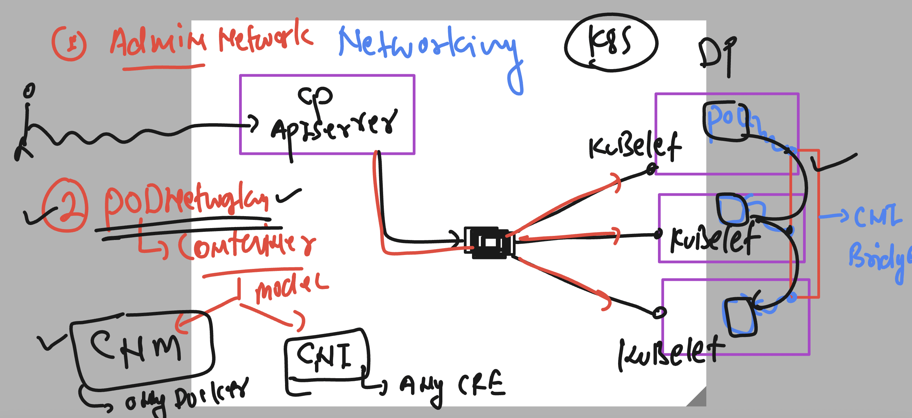
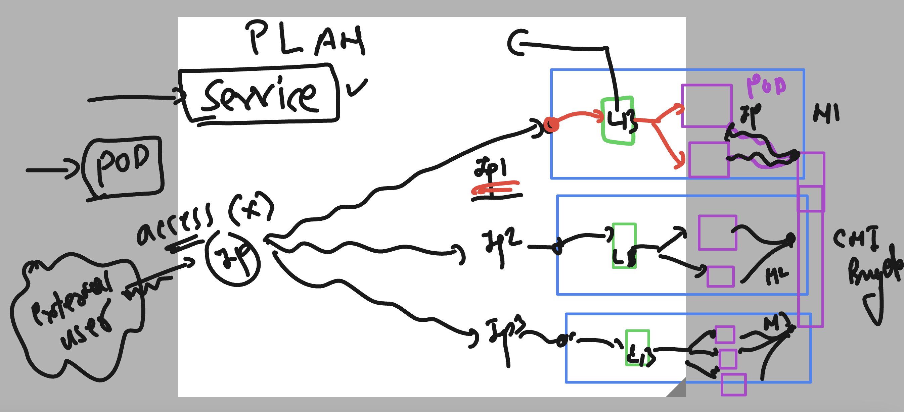
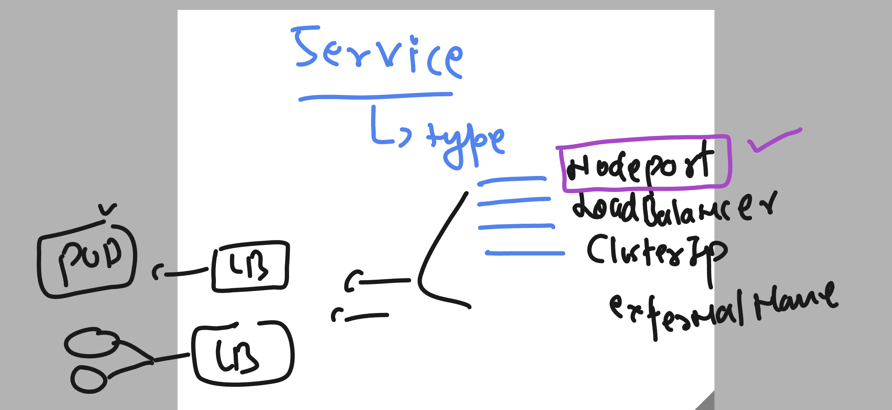

# docker-k8s-ocp-kyndryl

### Revision of Docker 


### Revision of k8s 


### verify lab connection 

```
[ashu@ip-172-31-91-107 ~]$ kubectl  get  nodes
NAME     STATUS   ROLES           AGE   VERSION
master   Ready    control-plane   3d    v1.27.4
node1    Ready    <none>          3d    v1.27.4
node2    Ready    <none>          3d    v1.27.4
[ashu@ip-172-31-91-107 ~]$ kubectl  cluster-info 
Kubernetes control plane is running at https://172.31.86.69:6443
CoreDNS is running at https://172.31.86.69:6443/api/v1/namespaces/kube-system/services/kube-dns:dns/proxy

To further debug and diagnose cluster problems, use 'kubectl cluster-info dump'.
[ashu@ip-172-31-91-107 ~]$ 
```

## A manifest file -- for creating Pod 

### Sending Create Request to APiserver

```
[ashu@ip-172-31-91-107 ~]$ ls
admin.conf    ashu-customer  ashu-website  final-project-ashu  k8s-docs   python-code
ashu-compose  ashu-task4     database      java-code           k8s-files  webapp
[ashu@ip-172-31-91-107 ~]$ cd k8s-files/
[ashu@ip-172-31-91-107 k8s-files]$ ls
ashupod1.yaml
[ashu@ip-172-31-91-107 k8s-files]$ kubectl  create -f  ashupod1.yaml 
pod/ashupod created
[ashu@ip-172-31-91-107 k8s-files]$ kubectl  get  pods
NAME         READY   STATUS    RESTARTS   AGE
ashupod      1/1     Running   0          7s
ashwinipod   1/1     Running   0          8s
[ashu@ip-172-31-91-107 k8s-files]$ 
```

### Understanding Etcd component of control plane machine 


### creating a pod manifest with multi container concept 

```
apiVersion: v1 
kind: Pod 
metadata: # info about kind  
  name: ashupod  # name of my first pod 
spec: # all the details about your app like volume,security,containers
  containers:
  - name: ashuc2
    image: alpine 
    command: ['sh','-c','sleep 10000']
  - name: ashuc1 
    image: docker.io/dockerashu/ashu-customer1:releasev1
    ports: # optional part 
    - containerPort: 80 # app server port of docker image
```

### lets apply changes

```
[ashu@ip-172-31-91-107 k8s-files]$ kubectl replace -f  ashupod1.yaml  --force 
pod "ashupod" deleted
pod/ashupod replaced
[ashu@ip-172-31-91-107 k8s-files]$ kubectl  get  pods
NAME           READY   STATUS        RESTARTS   AGE
ashupod        2/2     Running       0          9s
```

### connecting to particular container

```
[ashu@ip-172-31-91-107 k8s-files]$ kubectl exec -it ashupod -c ashuc1  -- bash 
[root@ashupod code]# ls
deploy.sh  webapp1  webapp2  webapp3
[root@ashupod code]# exit
exit


[ashu@ip-172-31-91-107 k8s-files]$ kubectl exec -it ashupod -c ashuc2  -- sh 
/ # ls
bin    dev    etc    home   lib    media  mnt    opt    proc   root   run    sbin   srv    sys    tmp    usr    var
/ # exit
```

### deleting pods

```
[ashu@ip-172-31-91-107 k8s-files]$ kubectl delete pod ashupod
pod "ashupod" deleted

```

### auto generated manifest file

```
[ashu@ip-172-31-91-107 k8s-files]$ kubectl  run  ashupod2  --image=docker.io/dockerashu/ashu-customer1:releasev1 --port 80  --dry-run=client  -o yaml 
apiVersion: v1
kind: Pod
metadata:
  creationTimestamp: null
  labels:
    run: ashupod2
  name: ashupod2
spec:
  containers:
  - image: docker.io/dockerashu/ashu-customer1:releasev1
    name: ashupod2
    ports:
    - containerPort: 80
    resources: {}
  dnsPolicy: ClusterFirst
  restartPolicy: Always
status: {}
[ashu@ip-172-31-91-107 k8s-files]$ kubectl  run  ashupod2  --image=docker.io/dockerashu/ashu-customer1:releasev1 --port 80  --dry-run=client  -o yaml       >ashupod_auto.yaml 
[ashu@ip-172-31-91-107 k8s-files]$ kubectl  run  ashupod2  --image=docker.io/dockerashu/ashu-customer1:releasev1 --port 80  --dry-run=client  -o json      >newpod.json 
[ashu@ip-172-31-91-107 k8s-files]$ 

```

### testing 

```
ashu@ip-172-31-91-107 k8s-files]$ ls
ashupod1.yaml  ashupod_auto.yaml  newpod.json
[ashu@ip-172-31-91-107 k8s-files]$ kubectl  create -f newpod.json 
pod/ashupod2 created
[ashu@ip-172-31-91-107 k8s-files]$ kubectl  get  po
NAME       READY   STATUS    RESTARTS   AGE
ashupod2   1/1     Running   0          3s
[ashu@ip-172-31-91-107 k8s-files]$ kubectl delete -f newpod.json 
pod "ashupod2" deleted


```

### Pod networking by k8s 



## Testing pod networking 
### creating and checking pod

```
[ashu@ip-172-31-91-107 k8s-files]$ kubectl  run ashu-webpod --image=dockerashu/ashu-customer1:releasev1 --port 80 --dry-run=client  -o yaml >webapod.yaml 
[ashu@ip-172-31-91-107 k8s-files]$ ls
ashupod1.yaml  ashupod_auto.yaml  logs.txt  newpod.json  task1.yaml  webapod.yaml

[ashu@ip-172-31-91-107 k8s-files]$ kubectl create -f webapod.yaml 
pod/ashu-webpod created

[ashu@ip-172-31-91-107 k8s-files]$ kubectl get pods -o wide
NAME          READY   STATUS    RESTARTS   AGE   IP               NODE    NOMINATED NODE   READINESS GATES
ashu-webpod   1/1     Running   0          5s    192.168.104.28   node2   <none>           <none>
[ashu@ip-172-31-91-107 k8s-files]$ 

```

### testing pod connecting using curl http request maker 

```
ashu@ip-172-31-91-107 k8s-files]$ kubectl exec -it  ashu-webpod -- bash 
[root@ashu-webpod code]# 
[root@ashu-webpod code]# 
[root@ashu-webpod code]# curl 
curl: try 'curl --help' or 'curl --manual' for more information
[root@ashu-webpod code]# 
[root@ashu-webpod code]# curl  http://192.168.166.143
Please check your variable or Value
[root@ashu-webpod code]# curl  http://192.168.166.144
Please check your variable or Value
[root@ashu-webpod code]# curl  http://192.168.104.30
Please check your variable or Value
```

### Introductiont to k8s internal LB -- using Service Resource 



### type of service in k8s 



### creating nodeport type service 

```
[ashu@ip-172-31-91-107 k8s-files]$ kubectl  get  pod
NAME               READY   STATUS    RESTARTS   AGE
ashu-webpod        1/1     Running   0          41m
ashwini-webpod     1/1     Running   0          37m
nagashree-webpod   1/1     Running   0          36m
nidhi-webpod       1/1     Running   0          36m
rakshitha-webpod   1/1     Running   0          39m
yashna-webpod      1/1     Running   0          35m

[ashu@ip-172-31-91-107 k8s-files]$ kubectl expose  pod  ashu-webpod --type NodePort --port 80 --name ashulb1 --dry-run=client -o yaml  >ashusvc1.yaml

[ashu@ip-172-31-91-10
```

### a visual look of service manifest file

```
apiVersion: v1
kind: Service
metadata:
  creationTimestamp: null
  labels:
    run: ashu-webpod
  name: ashulb1
spec:
  ports:
  - port: 80
    protocol: TCP
    targetPort: 80
  selector:
    run: ashu-webpod
  type: NodePort
status:
  loadBalancer: {}

```

### creating it 

```
[ashu@ip-172-31-91-107 k8s-files]$ kubectl  create -f ashusvc1.yaml 
service/ashulb1 created
[ashu@ip-172-31-91-107 k8s-files]$ kubectl  get  svc
NAME         TYPE        CLUSTER-IP       EXTERNAL-IP   PORT(S)        AGE
ashulb1      NodePort    10.100.246.205   <none>        80:30816/TCP   5s
```


