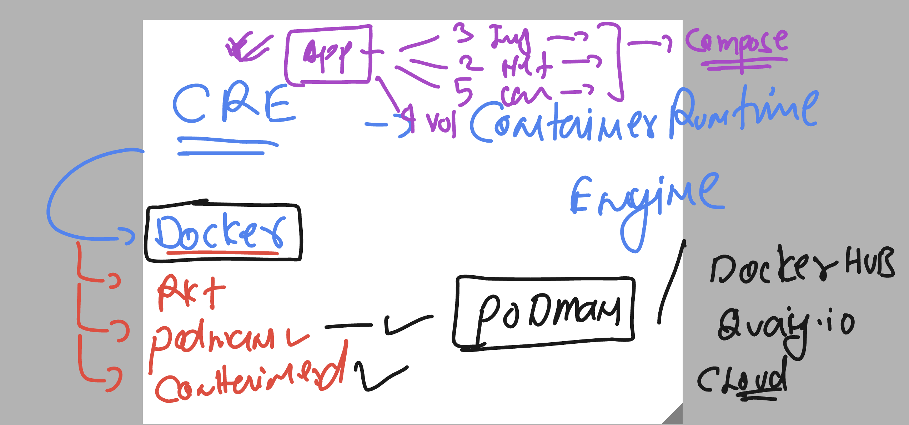
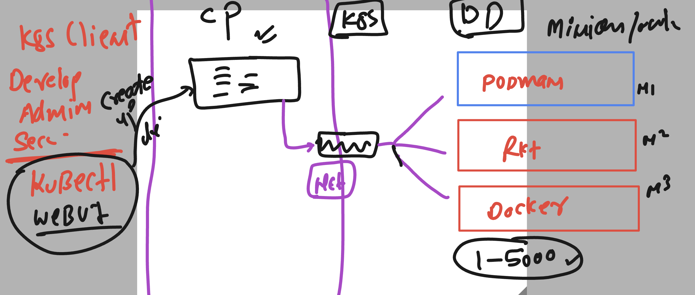

# docker-k8s-ocp-kyndryl

### Revision of Docker 



### Revision of k8s 



### verify lab connection 

```
[ashu@ip-172-31-91-107 ~]$ kubectl  get  nodes
NAME     STATUS   ROLES           AGE   VERSION
master   Ready    control-plane   3d    v1.27.4
node1    Ready    <none>          3d    v1.27.4
node2    Ready    <none>          3d    v1.27.4
[ashu@ip-172-31-91-107 ~]$ kubectl  cluster-info 
Kubernetes control plane is running at https://172.31.86.69:6443
CoreDNS is running at https://172.31.86.69:6443/api/v1/namespaces/kube-system/services/kube-dns:dns/proxy

To further debug and diagnose cluster problems, use 'kubectl cluster-info dump'.
[ashu@ip-172-31-91-107 ~]$ 
```

## A manifest file -- for creating Pod 

### Sending Create Request to APiserver

```
[ashu@ip-172-31-91-107 ~]$ ls
admin.conf    ashu-customer  ashu-website  final-project-ashu  k8s-docs   python-code
ashu-compose  ashu-task4     database      java-code           k8s-files  webapp
[ashu@ip-172-31-91-107 ~]$ cd k8s-files/
[ashu@ip-172-31-91-107 k8s-files]$ ls
ashupod1.yaml
[ashu@ip-172-31-91-107 k8s-files]$ kubectl  create -f  ashupod1.yaml 
pod/ashupod created
[ashu@ip-172-31-91-107 k8s-files]$ kubectl  get  pods
NAME         READY   STATUS    RESTARTS   AGE
ashupod      1/1     Running   0          7s
ashwinipod   1/1     Running   0          8s
[ashu@ip-172-31-91-107 k8s-files]$ 
```


