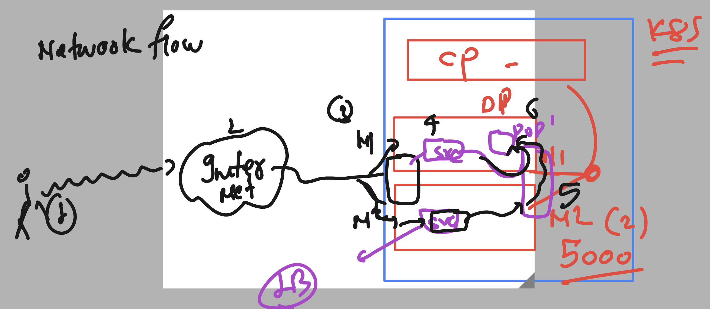
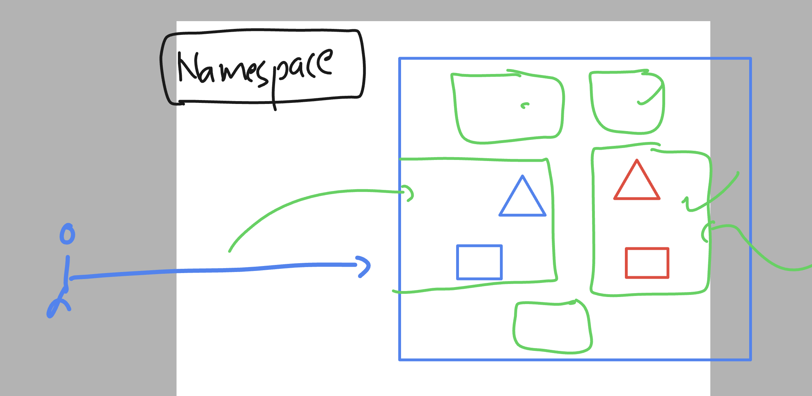
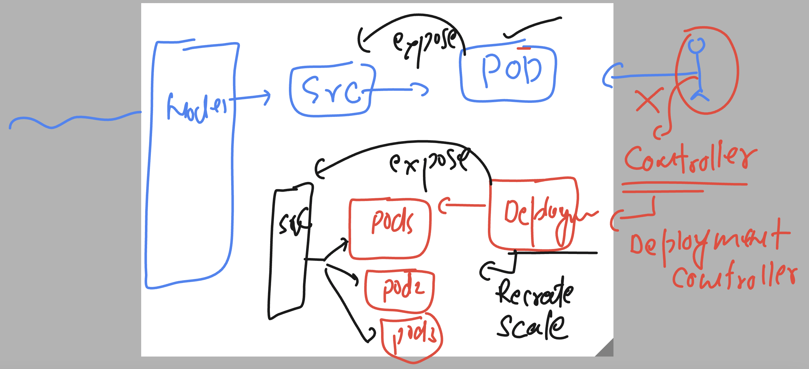

# docker-k8s-ocp-kyndryl
### k8s Network flow understanding 



## namespace in k8s



### listing namespaces of k8s 

```
[ashu@ip-172-31-91-107 ~]$ kubectl   get   namespaces 
NAME                   STATUS   AGE
default                Active   4d
kube-node-lease        Active   4d
kube-public            Active   4d
kube-system            Active   4d
kubernetes-dashboard   Active   4d
```

### creating namespace

```
[ashu@ip-172-31-91-107 ~]$ kubectl create  namespace  ashu-project
namespace/ashu-project created
[ashu@ip-172-31-91-107 ~]$ kubectl   get   namespaces 
NAME                   STATUS   AGE
ashu-project           Active   2s
default                Active   4d
```

### setting namespace as default 

```
[ashu@ip-172-31-91-107 ~]$ kubectl  config set-context --current --namespace=ashu-project
Context "kubernetes-admin@kubernetes" modified.
[ashu@ip-172-31-91-107 ~]$ kubectl get pods
No resources found in ashu-project namespace.
[ashu@ip-172-31-91-107 ~]$ 
```

### creating pod 

```
[ashu@ip-172-31-91-107 ~]$ mkdir  day7
[ashu@ip-172-31-91-107 ~]$ cd day7/
[ashu@ip-172-31-91-107 day7]$ kubectl run ashu-webpod --image=docker.io/dockerashu/ashu-customer1:releasev1 --port 80 --dry-run=client -o yaml >pod1.yaml 
[ashu@ip-172-31-91-107 day7]$ 


```

### updating ENV in pod manifest

```
apiVersion: v1
kind: Pod
metadata:
  creationTimestamp: null
  labels:
    run: ashu-webpod
  name: ashu-webpod
spec:
  containers:
  - image: docker.io/dockerashu/ashu-customer1:releasev1
    name: ashu-webpod
    ports:
    - containerPort: 80
    resources: {}
    env:
    - name: web
      value: myapp2 
  dnsPolicy: ClusterFirst
  restartPolicy: Always
status: {}

```

### creating it 

```
[ashu@ip-172-31-91-107 day7]$ ls
pod1.yaml
[ashu@ip-172-31-91-107 day7]$ kubectl  create -f pod1.yaml 
pod/ashu-webpod created
[ashu@ip-172-31-91-107 day7]$ kubectl  get  pods
NAME          READY   STATUS    RESTARTS   AGE
ashu-webpod   1/1     Running   0          4s
[ashu@ip-172-31-91-107 day7]$ 


```

### creating nodeport service by exposing pod 

```
[ashu@ip-172-31-91-107 day7]$ kubectl get pods
NAME          READY   STATUS    RESTARTS   AGE
ashu-webpod   1/1     Running   0          3m57s
[ashu@ip-172-31-91-107 day7]$ kubectl  expose pod  ashu-webpod  --type NodePort --port 80 --name ashulb1 --dry-run=client -o yaml  >nodeport.yaml 
[ashu@ip-172-31-91-107 day7]$ ls
nodeport.yaml  pod1.yaml
[ashu@ip-172-31-91-107 day7]$ kubectl  create -f nodeport.yaml 
service/ashulb1 created
[ashu@ip-172-31-91-107 day7]$ kubectl get svc
NAME      TYPE       CLUSTER-IP     EXTERNAL-IP   PORT(S)        AGE
ashulb1   NodePort   10.103.12.59   <none>        80:31333/TCP   3s
[ashu@ip-172-31-91-107 day7]$ kubectl get service
NAME      TYPE       CLUSTER-IP     EXTERNAL-IP   PORT(S)        AGE
ashulb1   NodePort   10.103.12.59   <none>        80:31333/TCP   7s
[ashu@ip-172-31-91-107 day7]$ 

```

## Deployment controller introduction 



### deleting pod,svc 

```
[ashu@ip-172-31-91-107 day7]$ kubectl get po,svc
NAME              READY   STATUS    RESTARTS   AGE
pod/ashu-webpod   1/1     Running   0          22m

NAME              TYPE       CLUSTER-IP     EXTERNAL-IP   PORT(S)        AGE
service/ashulb1   NodePort   10.103.12.59   <none>        80:31333/TCP   17m
[ashu@ip-172-31-91-107 day7]$ 
[ashu@ip-172-31-91-107 day7]$ kubectl  delete pod,svc --all
pod "ashu-webpod" deleted
service "ashulb1" deleted

```

### creating deployment controller based pods

```
 kubectl  create  deployment  ashu-app-deploy  --image=docker.io/dockerashu/ashu-customer1:releasev1 --port 80 --dry-run=client -o yaml >deployment1.yaml
```

### updating manifest 

```
apiVersion: apps/v1
kind: Deployment
metadata:
  creationTimestamp: null
  labels:
    app: ashu-app-deploy
  name: ashu-app-deploy # name of deployment 
spec:
  replicas: 1 # number of pods we want 
  selector:
    matchLabels:
      app: ashu-app-deploy
  strategy: {}
  template: # deployment will be using pod template to create multiple pods
    metadata:
      creationTimestamp: null
      labels:
        app: ashu-app-deploy
    spec:
      containers:
      - image: docker.io/dockerashu/ashu-customer1:releasev1
        name: ashu-customer1
        ports:
        - containerPort: 80
        resources: {}
        env:
        - name: web
          value: myapp3 
status: {}

```

### creating it 

```
[ashu@ip-172-31-91-107 day7]$ kubectl  create -f deployment1.yaml 
deployment.apps/ashu-app-deploy created
[ashu@ip-172-31-91-107 day7]$ 
[ashu@ip-172-31-91-107 day7]$ kubectl get  deployment 
NAME              READY   UP-TO-DATE   AVAILABLE   AGE
ashu-app-deploy   1/1     1            1           5s
[ashu@ip-172-31-91-107 day7]$ kubectl  get  pods
NAME                               READY   STATUS    RESTARTS   AGE
ashu-app-deploy-64bcd577fb-sw4zf   1/1     Running   0          9s
[ashu@ip-172-31-91-107 day7]$ 

```

### self healing / recreation 

```
[ashu@ip-172-31-91-107 day7]$ kubectl  get  pods
NAME                               READY   STATUS    RESTARTS   AGE
ashu-app-deploy-64bcd577fb-sw4zf   1/1     Running   0          16m
[ashu@ip-172-31-91-107 day7]$ kubectl  get  pods -o wide
NAME                               READY   STATUS    RESTARTS   AGE   IP               NODE    NOMINATED NODE   READINESS GATES
ashu-app-deploy-64bcd577fb-sw4zf   1/1     Running   0          16m   192.168.104.51   node2   <none>           <none>
[ashu@ip-172-31-91-107 day7]$ kubectl delete pod ashu-app-deploy-64bcd577fb-sw4zf
pod "ashu-app-deploy-64bcd577fb-sw4zf" deleted
[ashu@ip-172-31-91-107 day7]$ kubectl  get  pods -o wide
NAME                               READY   STATUS    RESTARTS   AGE   IP               NODE    NOMINATED NODE   READINESS GATES
ashu-app-deploy-64bcd577fb-5rk2w   1/1     Running   0          38s   192.168.104.55   node2   <none>           <none>
[ashu@ip-172-31-91-107 day7]$ 

```

### scaling pods using updating replicas=3 in manifest file

```
[ashu@ip-172-31-91-107 day7]$ kubectl apply -f deployment1.yaml 
Warning: resource deployments/ashu-app-deploy is missing the kubectl.kubernetes.io/last-applied-configuration annotation which is required by kubectl apply. kubectl apply should only be used on resources created declaratively by either kubectl create --save-config or kubectl apply. The missing annotation will be patched automatically.
deployment.apps/ashu-app-deploy configured
[ashu@ip-172-31-91-107 day7]$ kubectl  get  deployment 
NAME              READY   UP-TO-DATE   AVAILABLE   AGE
ashu-app-deploy   3/3     3            3           20m
[ashu@ip-172-31-91-107 day7]$ kubectl get pods
NAME                               READY   STATUS    RESTARTS   AGE
ashu-app-deploy-64bcd577fb-5rk2w   1/1     Running   0          4m13s
ashu-app-deploy-64bcd577fb-jcqhl   1/1     Running   0          10s
ashu-app-deploy-64bcd577fb-vsq8m   1/1     Running   0          10s
```

## Its not a good idea to change replica count in the YAML manifest 

### to scale pod using deployment controller 

```
[ashu@ip-172-31-91-107 day7]$ kubectl get deploy 
NAME              READY   UP-TO-DATE   AVAILABLE   AGE
ashu-app-deploy   1/1     1            1           91m

[ashu@ip-172-31-91-107 day7]$ kubectl  scale  deployment  ashu-app-deploy  --replicas=4
deployment.apps/ashu-app-deploy scaled

[ashu@ip-172-31-91-107 day7]$ kubectl get deploy 
NAME              READY   UP-TO-DATE   AVAILABLE   AGE
ashu-app-deploy   4/4     4            4           92m

[ashu@ip-172-31-91-107 day7]$ kubectl get po
NAME                               READY   STATUS    RESTARTS   AGE
ashu-app-deploy-64bcd577fb-jcqhl   1/1     Running   0          71m
ashu-app-deploy-64bcd577fb-knlnv   1/1     Running   0          15s
ashu-app-deploy-64bcd577fb-n5kq5   1/1     Running   0          15s
ashu-app-deploy-64bcd577fb-w29sm   1/1     Running   0          15s
[ashu@ip-172-31-91-107 day7]$ 
```

### svc always create EP database to maintain IPaddress of pods 

```
[ashu@ip-172-31-91-107 day7]$ kubectl  get svc
NAME   TYPE           CLUSTER-IP       EXTERNAL-IP   PORT(S)        AGE
lb1    LoadBalancer   10.111.118.239   <pending>     80:31178/TCP   80m
[ashu@ip-172-31-91-107 day7]$ 
[ashu@ip-172-31-91-107 day7]$ 
[ashu@ip-172-31-91-107 day7]$ kubectl  get  ep 
NAME   ENDPOINTS                                                            AGE
lb1    192.168.104.11:80,192.168.104.13:80,192.168.166.165:80 + 1 more...   81m
[ashu@ip-172-31-91-107 day7]$ 
```

### k8s manifest file 

```
apiVersion: apps/v1
kind: Deployment
metadata:
  creationTimestamp: null
  labels:
    app: ashu-app-deploy
  name: ashu-app-deploy # name of deployment 
spec:
  replicas: 1 # number of pods we want 
  selector:
    matchLabels:
      app: ashu-app-deploy
  strategy: {}
  template: # deployment will be using pod template to create multiple pods
    metadata:
      creationTimestamp: null
      labels:
        app: ashu-app-deploy
    spec:
      containers:
      - image: docker.io/dockerashu/ashu-customer1:releasev1
        name: ashu-customer1
        ports:
        - containerPort: 80
        resources: {}
        env:
        - name: web
          value: myapp3 
status: {}

---

apiVersion: v1
kind: Service
metadata:
  creationTimestamp: null
  labels:
    app: ashu-app-deploy
  name: lb1
spec:
  ports:
  - port: 80
    protocol: TCP
    targetPort: 80
  selector:
    app: ashu-app-deploy
  type: LoadBalancer
status:
  loadBalancer: {}

```

### sending create request

```
[ashu@ip-172-31-91-107 day7]$ kubectl create -f  ashu-merge.yaml 
deployment.apps/ashu-app-deploy created
service/lb1 created
[ashu@ip-172-31-91-107 day7]$ kubectl delete -f ashu-merge.yaml 
deployment.apps "ashu-app-deploy" deleted
service "lb1" deleted
[ashu@ip-172-31-91-107 day7]$ 

```

### creating merge manifest

```
apiVersion: v1
kind: Namespace
metadata:
  creationTimestamp: null
  name: ashuk8s
spec: {}
status: {}

---
apiVersion: v1
kind: Pod
metadata:
  creationTimestamp: null
  labels:
    run: ashupod1
  name: ashupod1
  namespace: ashuk8s # defining namespace manually 
spec:
  containers:
  - command:
    - sleep
    - "10000"
    image: ubuntu:latest
    name: ashupod1
    resources: {}
  dnsPolicy: ClusterFirst
  restartPolicy: Always
status: {}

---
apiVersion: v1
kind: Service
metadata:
  creationTimestamp: null
  labels:
    app: ashusvc1
  name: ashusvc1
  namespace: ashuk8s
spec:
  ports:
  - name: 1234-80
    port: 1234
    protocol: TCP
    targetPort: 80
    nodePort: 31009 # static selection of port 
  selector:
    app: ashusvc1
  type: NodePort
status:
  loadBalancer: {}
```

### 

```
[ashu@ip-172-31-91-107 day7]$ kubectl  get  po  -n ashuk8s 
NAME       READY   STATUS    RESTARTS   AGE
ashupod1   1/1     Running   0          6s
[ashu@ip-172-31-91-107 day7]$ kubectl  get  svc  -n ashuk8s 
NAME       TYPE       CLUSTER-IP      EXTERNAL-IP   PORT(S)          AGE
ashusvc1   NodePort   10.110.78.206   <none>        1234:31009/TCP   9s
[ashu@ip-172-31-91-107 day7]$ ls
ashu-merge.yaml  deployment1.yaml  lb.yaml  mytask.yaml  nodeport.yaml  pod1.yaml
[ashu@ip-172-31-91-107 day7]$ 
[ashu@ip-172-31-91-107 day7]$ 
[ashu@ip-172-31-91-107 day7]$ kubectl -n  ashuk8s cp  pod1.yaml   ashupod1:/tmp/
[ashu@ip-172-31-91-107 day7]$ 


```

### useful commands

```
[ashu@ip-172-31-91-107 day7]$ kubectl  get  deploy  -A
NAMESPACE              NAME                        READY   UP-TO-DATE   AVAILABLE   AGE
ashu-project           ashu-app                    1/1     1            1           7m17s
ashwini-project        ashwini-app-deploy          1/1     1            1           53m
ashwinik8s1            ashwini-app                 1/1     1            1           7m10s
ashwinik8s1            ashwini-tomapp              1/1     1            1           3m5s
kube-system            calico-kube-controllers     1/1     1            1           4d3h
kube-system            coredns                     2/2     2            2           4d4h
```

### creating svc

```
[ashu@ip-172-31-91-107 day7]$ kubectl get deploy
NAME       READY   UP-TO-DATE   AVAILABLE   AGE
ashu-app   1/1     1            1           9m23s
[ashu@ip-172-31-91-107 day7]$ 
[ashu@ip-172-31-91-107 day7]$ kubectl expose deployment ashu-app  --type NodePort --port 8080 --name ashulb4 --dry-run=client -o yaml >svcc.yml
[ashu@ip-172-31-91-107 day7]$ kubectl create -f svcc.yml 
service/ashulb4 created
[ashu@ip-172-31-91-107 day7]$ kubectl  get  svc
NAME      TYPE       CLUSTER-IP       EXTERNAL-IP   PORT(S)          AGE
ashulb4   NodePort   10.111.128.201   <none>        8080:32336/TCP   4s
[ashu@ip-172-31-91-107 day7]$ 
[ashu@ip-172-31-91-107 day7]$ 
[ashu@ip-172-31-91-107 day7]$ kubectl get ep
NAME      ENDPOINTS             AGE
ashulb4   192.168.104.20:8080   7s
[ashu@ip-172-31-91-107 day7]$ 

```


