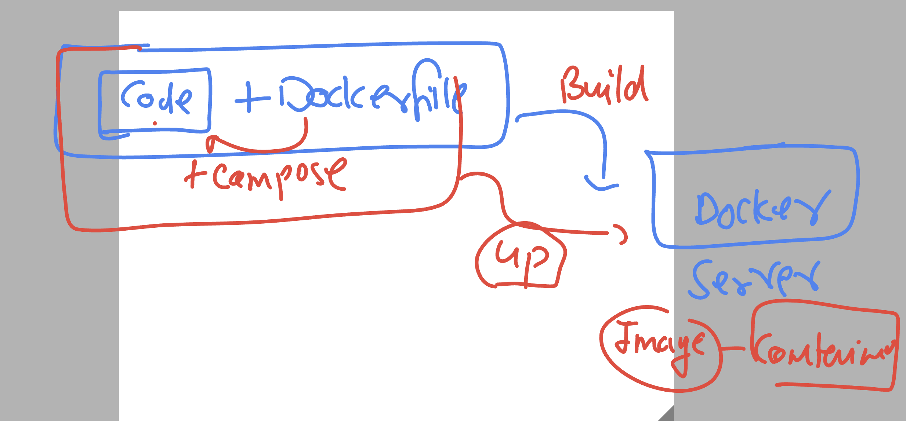
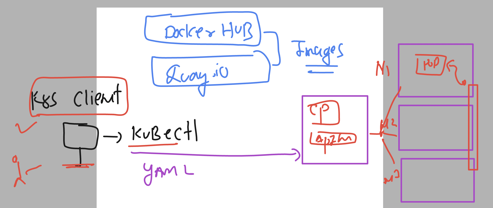
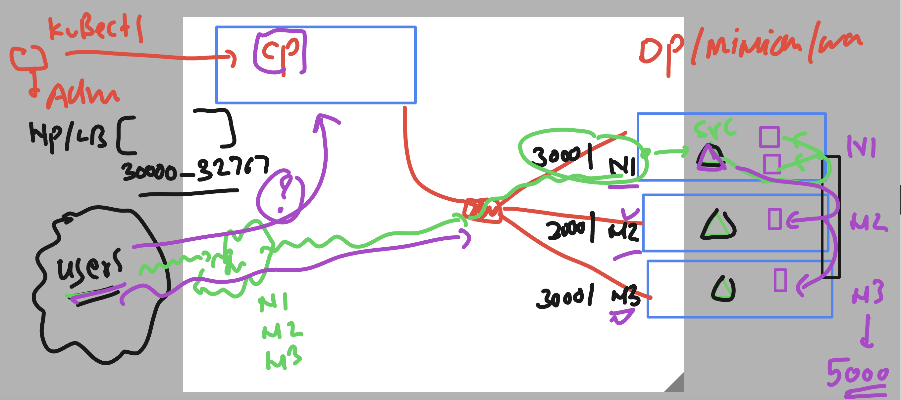
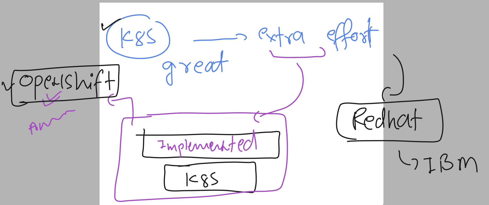
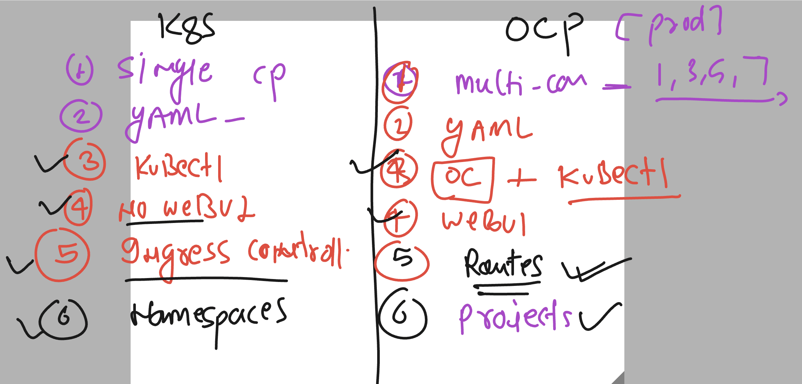

# docker-k8s-ocp-kyndryl

### docker and compose revision 



### k8s Internal understanding 



### network flow of k8s app accessing 



## Introducing Openshift



### k8s vs OCP -- all you need to know as freshers



### Removing k8s cred and putting it ocp cred

```
[ashu@ip-172-31-91-107 ~]$ cd  ~/.kube/
[ashu@ip-172-31-91-107 .kube]$ ls
cache  config
[ashu@ip-172-31-91-107 .kube]$ mv  config  k8s-cred.conf
[ashu@ip-172-31-91-107 .kube]$ ls
cache  k8s-cred.conf
[ashu@ip-172-31-91-107 .kube]$ pwd
/home/ashu/.kube
[ashu@ip-172-31-91-107 .kube]$ ls
cache  k8s-cred.conf
[ashu@ip-172-31-91-107 .kube]$ cp -v  /tmp/kubeconfig   .
‘/tmp/kubeconfig’ -> ‘./kubeconfig’
[ashu@ip-172-31-91-107 .kube]$ ls
cache  k8s-cred.conf  kubeconfig
[ashu@ip-172-31-91-107 .kube]$ mv  kubeconfig config 
[ashu@ip-172-31-91-107 .kube]$ ls
cache  config  k8s-cred.conf
```

### verify 

```
[ashu@ip-172-31-91-107 ~]$ oc version 
Client Version: 4.13.6
Kustomize Version: v4.5.7
Server Version: 4.13.6
Kubernetes Version: v1.26.6+73ac561
[ashu@ip-172-31-91-107 ~]$ 
```

### chekcing more things 

```
[ashu@ip-172-31-91-107 ~]$ oc  get  nodes
NAME                           STATUS   ROLES                  AGE   VERSION
ip-10-0-132-18.ec2.internal    Ready    control-plane,master   26h   v1.26.6+73ac561
ip-10-0-135-26.ec2.internal    Ready    worker                 26h   v1.26.6+73ac561
ip-10-0-135-57.ec2.internal    Ready    worker                 26h   v1.26.6+73ac561
ip-10-0-191-94.ec2.internal    Ready    control-plane,master   26h   v1.26.6+73ac561
ip-10-0-213-214.ec2.internal   Ready    control-plane,master   26h   v1.26.6+73ac561
[ashu@ip-172-31-91-107 ~]$ 
```

### Project as Smarter and having extra feature than namesapce

```
ashu@ip-172-31-91-107 ~]$ oc projects
You have access to the following projects and can switch between them with ' project <projectname>':

default
kube-node-lease
kube-public
kube-system
openshift
openshift-apiserver
openshift-apiserver-operator
openshift-authentication
openshift-authentication-operator
openshift-cloud-controller-manager
openshift-cloud-controller-manager-operator
openshift-cloud-credential-operator
openshift-cloud-network-config-controller
openshift-cluster-csi-drivers
```

## How to get webUI access 

### checking project which has webportal deployed

```
[ashu@ip-172-31-91-107 ~]$ oc projects   |  grep  console 
openshift-console
openshift-console-operator
openshift-console-user-settings
[ashu@ip-172-31-91-107 ~]$ 
[ashu@ip-172-31-91-107 ~]$ oc  get  pods
No resources found in default namespace.

[ashu@ip-172-31-91-107 ~]$ 
[ashu@ip-172-31-91-107 ~]$ oc  get  pods -n openshift-console
NAME                         READY   STATUS    RESTARTS        AGE
console-85d689885-9rm46      1/1     Running   1               26h
console-85d689885-h86mt      1/1     Running   1               26h
downloads-55ff47758f-ggl9p   1/1     Running   2 (3h22m ago)   26h
downloads-55ff47758f-rnb4h   1/1     Running   2 (3h22m ago)   26h

[ashu@ip-172-31-91-107 ~]$ oc  get  deploy  -n openshift-console
NAME        READY   UP-TO-DATE   AVAILABLE   AGE
console     2/2     2            2           26h
downloads   2/2     2            2           26h

====>>
[ashu@ip-172-31-91-107 ~]$ oc  get  svc   -n openshift-console
NAME        TYPE        CLUSTER-IP      EXTERNAL-IP   PORT(S)   AGE
console     ClusterIP   172.30.91.159   <none>        443/TCP   26h
downloads   ClusterIP   172.30.97.159   <none>        80/TCP

======>>
[ashu@ip-172-31-91-107 ~]$ oc  get  routes   -n openshift-console
NAME        HOST/PORT                                                   PATH   SERVICES    PORT    TERMINATION          WILDCARD
console     console-openshift-console.apps.dev-cluster.ashutoshh.in            console     https   reencrypt/Redirect   None
downloads   downloads-openshift-console.apps.dev-cluster.ashutoshh.in          downloads   http    edge/Redirect        None
```


