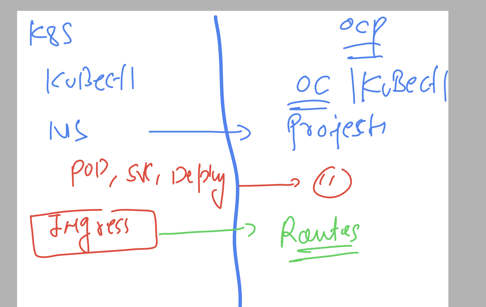
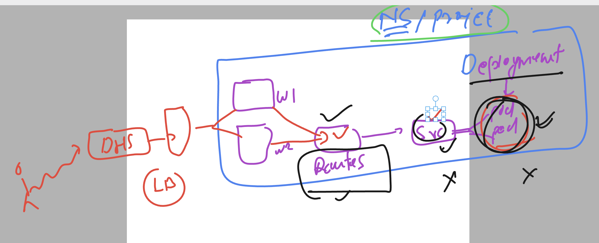
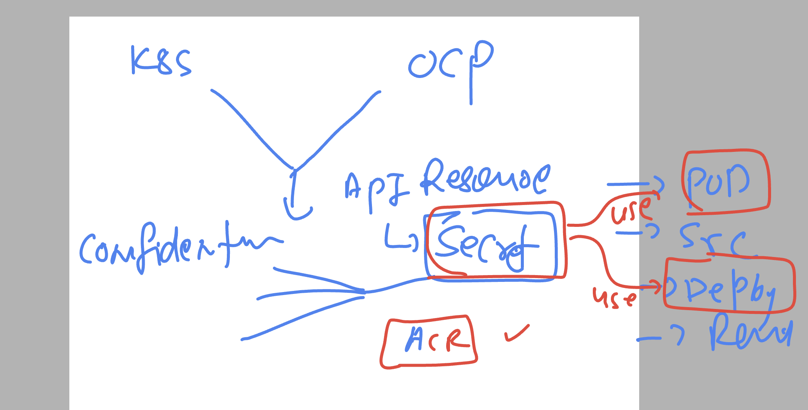
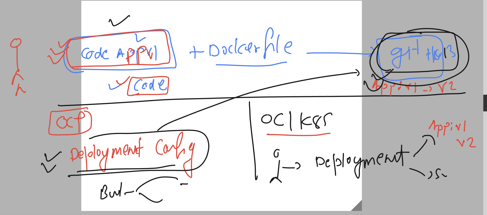

# docker-k8s-ocp-kyndryl

### OC vs k8s 



### checking current project and cleaning up the data

```
[ashu@ip-172-31-91-107 ~]$ oc project
Using project "ashu-day10" on server "https://api.dev-cluster.ashutoshh.in:6443".
[ashu@ip-172-31-91-107 ~]$ oc get  all
NAME                           READY   STATUS    RESTARTS   AGE
pod/ashu-dep-dc4c58857-b57cb   1/1     Running   1          2d22h

NAME                       READY   UP-TO-DATE   AVAILABLE   AGE
deployment.apps/ashu-dep   1/1     1            1           2d22h

NAME                                 DESIRED   CURRENT   READY   AGE
replicaset.apps/ashu-dep-dc4c58857   1         1         1       2d22h
[ashu@ip-172-31-91-107 ~]$ oc delete all --all
pod "ashu-dep-dc4c58857-b57cb" deleted
deployment.apps "ashu-dep" deleted
replicaset.apps "ashu-dep-dc4c58857" deleted

```

### checking openshift networking flow 



### How to get openshift dashboard access

### checking pods in project 

```
[ashu@ip-172-31-91-107 ~]$ oc projects  | grep console 
    openshift-console
    openshift-console-operator
    openshift-console-user-settings

[ashu@ip-172-31-91-107 ~]$ oc get  pods -n  openshift-console
NAME                         READY   STATUS    RESTARTS      AGE
console-85d689885-9rm46      1/1     Running   4 (23m ago)   5d1h
console-85d689885-h86mt      1/1     Running   3             5d1h
downloads-55ff47758f-ggl9p   1/1     Running   6 (25m ago)   5d1h
downloads-55ff47758f-rnb4h   1/1     Running   6 (25m ago)   5d1h


```

### checking service and routes 

```
[ashu@ip-172-31-91-107 ~]$ oc get svc -n openshift-console
NAME        TYPE        CLUSTER-IP      EXTERNAL-IP   PORT(S)   AGE
console     ClusterIP   172.30.91.159   <none>        443/TCP   5d1h
downloads   ClusterIP   172.30.97.159   <none>        80/TCP    5d1h
[ashu@ip-172-31-91-107 ~]$

[ashu@ip-172-31-91-107 ~]$ 
[ashu@ip-172-31-91-107 ~]$ oc get routes  -n  openshift-console
NAME        HOST/PORT                                                   PATH   SERVICES    PORT    TERMINATION          WILDCARD
console     console-openshift-console.apps.dev-cluster.ashutoshh.in            console     https   reencrypt/Redirect   None
downloads   downloads-openshift-console.apps.dev-cluster.ashutoshh.in          downloads   http    edge/Redirect        None
[ashu@ip-172-31-91-107 ~]$ 


```

### Deploy all the manifest (yaml) -- using directory itself 

```
ashu@ip-172-31-91-107 ~]$ ls
backup  openshift-demos
[ashu@ip-172-31-91-107 ~]$ oc  apply -f  openshift-demos/
deployment.apps/ashu-dep created
pod/ashu-webapp created
route.route.openshift.io/ashu-access created
service/ashu-ui created

[ashu@ip-172-31-91-107 ~]$ oc get  deploy
NAME       READY   UP-TO-DATE   AVAILABLE   AGE
ashu-dep   1/1     1            1           6s

[ashu@ip-172-31-91-107 ~]$ oc get  pods
NAME                       READY   STATUS    RESTARTS   AGE
ashu-dep-dc4c58857-w86cs   1/1     Running   0          10s
ashu-webapp                1/1     Running   0          10s

[ashu@ip-172-31-91-107 ~]$ oc get  svc
NAME      TYPE        CLUSTER-IP      EXTERNAL-IP   PORT(S)   AGE
ashu-ui   ClusterIP   172.30.21.183   <none>        80/TCP    16s

[ashu@ip-172-31-91-107 ~]$ oc get  routes
NAME          HOST/PORT                                              PATH   SERVICES   PORT   TERMINATION   WILDCARD
ashu-access   ashu-access-ashu-day10.apps.dev-cluster.ashutoshh.in          ashu-ui    80                   None
[ashu@ip-172-31-91-107 ~]$ 
```

### Deploying private docker image can lead to below issue 

```
 oc apply -f deploy1.yaml

ashu@ip-172-31-91-107 final-day-apps]$ oc get  deploy 
NAME       READY   UP-TO-DATE   AVAILABLE   AGE
ashu-dep   0/1     1            0           75s
[ashu@ip-172-31-91-107 final-day-apps]$ 
[ashu@ip-172-31-91-107 final-day-apps]$ 
[ashu@ip-172-31-91-107 final-day-apps]$ oc get pods
NAME                        READY   STATUS             RESTARTS   AGE
ashu-dep-7dfc46668c-tgfc5   0/1     ImagePullBackOff   0          79s
[ashu@ip-172-31-91-107 final-day-apps]$ 
```

### Introduction to secret k8s & oc api-resources



### creating secret to store azure registry credentials

```
[ashu@ip-172-31-91-107 final-day-apps]$ oc create secret 
Create a secret using specified subcommand.

Available Commands:
  docker-registry   Create a secret for use with a Docker registry
  generic           Create a secret from a local file, directory, or literal value
  tls               Create a TLS secret

Usage:
  oc create secret [flags] [options]

Use "oc <command> --help" for more information about a given command.
Use "oc options" for a list of global command-line options (applies to all commands).
[ashu@ip-172-31-91-107 final-day-apps]$ oc create secret  docker-registry ashu-cred --docker-server kyndryl1.azurecr.io  --docker-username kyndryl1  --docker-password="W/Ij"  --dry-run=client -o yaml  >secret1.yaml 
[ashu@ip-172-31-91-107 final-day-apps]$ ls
deploy1.yaml  secret1.yaml
[ashu@ip-172-31-91-107 final-day-apps]$ oc apply -f secret1.yaml 
secret/ashu-cred created
[ashu@ip-172-31-91-107 final-day-apps]$ oc get secret
NAME                       TYPE                                  DATA   AGE
ashu-cred                  kubernetes.io/dockerconfigjson        1      3s
```

### updating deployment manifest to use image pull secrets

```
apiVersion: apps/v1
kind: Deployment
metadata:
  creationTimestamp: null
  labels:
    app: ashu-dep
  name: ashu-dep
spec:
  replicas: 1
  selector:
    matchLabels:
      app: ashu-dep
  strategy: {}
  template:
    metadata:
      creationTimestamp: null
      labels:
        app: ashu-dep
    spec:
      imagePullSecrets: # for calling secret while pulling image
      - name: ashu-cred 
      containers:
      - image: kyndryl1.azurecr.io/ashu-customer:v1
        name: ashu-customer
        ports:
        - containerPort: 80
        env:
        - name: web
          value: myapp3 
        resources: {}
status: {}

```

### redeploy it

```
ashu@ip-172-31-91-107 final-day-apps]$ ls
deploy1.yaml  secret1.yaml
[ashu@ip-172-31-91-107 final-day-apps]$ oc replace -f deploy1.yaml --force
deployment.apps "ashu-dep" deleted
deployment.apps/ashu-dep replaced

[ashu@ip-172-31-91-107 final-day-apps]$ oc get deploy
NAME       READY   UP-TO-DATE   AVAILABLE   AGE
ashu-dep   0/1     1            0           4s
[ashu@ip-172-31-91-107 final-day-apps]$ oc get deploy

NAME       READY   UP-TO-DATE   AVAILABLE   AGE
ashu-dep   0/1     1            0           6s
[ashu@ip-172-31-91-107 final-day-apps]$ oc get pods

NAME                        READY   STATUS              RESTARTS   AGE
ashu-dep-588795bb97-ns2c5   0/1     ContainerCreating   0          10s

[ashu@ip-172-31-91-107 final-day-apps]$ oc get pods
NAME                        READY   STATUS    RESTARTS   AGE
ashu-dep-588795bb97-ns2c5   1/1     Running   0          14s
[ashu@ip-172-31-91-107 final-day-apps]$ oc get deploy
NAME       READY   UP-TO-DATE   AVAILABLE   AGE
ashu-dep   1/1     1            1           17s
[ashu@ip-172-31-91-107 final-day-apps]$ 
```

### creating final app

```
[ashu@ip-172-31-91-107 final-day-apps]$ oc  get  deploy
NAME       READY   UP-TO-DATE   AVAILABLE   AGE
ashu-dep   1/1     1            1           12m
[ashu@ip-172-31-91-107 final-day-apps]$ oc  expose deployment  ashu-dep  --type ClusterIP --port 80 --name ashulb1 --dry-run=client -o yaml >svc.yaml 
[ashu@ip-172-31-91-107 final-day-apps]$ oc apply -f svc.yaml 
service/ashulb1 created
[ashu@ip-172-31-91-107 final-day-apps]$ oc get svc
NAME      TYPE        CLUSTER-IP      EXTERNAL-IP   PORT(S)   AGE
ashulb1   ClusterIP   172.30.82.241   <none>        80/TCP    5s
[ashu@ip-172-31-91-107 final-day-apps]$ oc expose service ashulb1 --name ashu-app1 --port 80 --dry-run=client -o yaml >route1.yaml 
[ashu@ip-172-31-91-107 final-day-apps]$ ls
deploy1.yaml  route1.yaml  secret1.yaml  svc.yaml
[ashu@ip-172-31-91-107 final-day-apps]$ oc apply -f route1.yaml 
route.route.openshift.io/ashu-app1 created
[ashu@ip-172-31-91-107 final-day-apps]$ oc get  routes
NAME        HOST/PORT                                            PATH   SERVICES   PORT   TERMINATION   WILDCARD
ashu-app1   ashu-app1-ashu-day10.apps.dev-cluster.ashutoshh.in          ashulb1    80                   None
[ashu@ip-172-31-91-107 final-day-apps]$ 

```

### Introduction to deployment config in Openshift 




